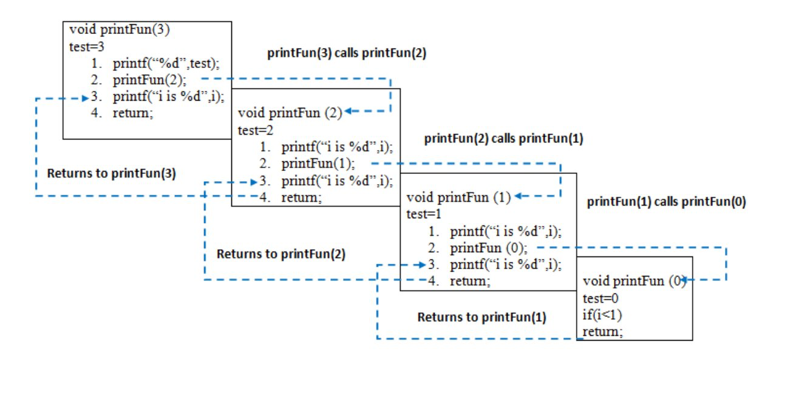
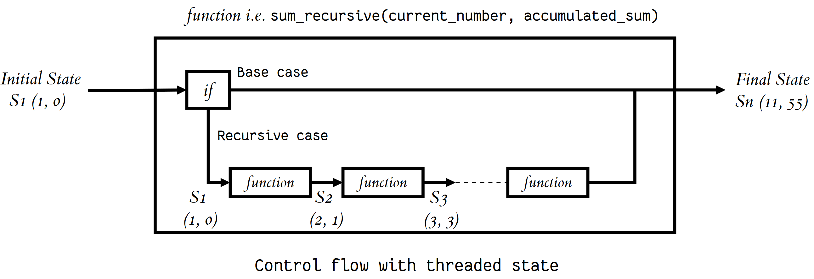

[Home Page](https://ikyle53.github.io)

# **102 Reading Notes**

## Table of contents

1. Growth mindset
2. Github syntax
3. Coder's computer
4. Git
5. HTML
6. CSS
7. Javascript

# **201 Reading Notes**

## Table of contents

1. [Introductory HTML and Javascript](https://github.com/ikyle53/ikyle53.github.io/blob/main/Reading_Notes/reading-notes.md#introductory-html-and-javascript)
2. [HTML Text, CSS Intro, Basic Javascript](https://github.com/ikyle53/ikyle53.github.io/blob/main/Reading_Notes/reading-notes.md#2-html-text-css-intro-basic-javascript)
3. [HTML Lists, CSS Boxes, JS Control Flow](https://github.com/ikyle53/ikyle53.github.io/blob/main/Reading_Notes/reading-notes.md#3-html-lists-css-boxes-js-control-flow)
4. [HTML Links](https://github.com/ikyle53/ikyle53.github.io/blob/main/Reading_Notes/reading-notes.md#4-html-links)
5. [HTML Images, CSS Color & Text](https://github.com/ikyle53/ikyle53.github.io/blob/main/Reading_Notes/reading-notes.md#5-html-images-css-color--text)
6. [JS Object Literals; The DOM  # 5. HTML Images, CSS Color & Text](https://github.com/ikyle53/ikyle53.github.io/blob/main/Reading_Notes/reading-notes.md#6-js-object-literals-the-dom---5-html-images-css-color--text)
7. [HTML Tables; JS Constructor Functions](https://github.com/ikyle53/ikyle53.github.io/blob/main/Reading_Notes/reading-notes.md#7-html-tables-js-constructor-functions)
8. [_More_ CSS Layout](https://github.com/ikyle53/ikyle53.github.io/blob/main/Reading_Notes/reading-notes.md#8-more-css-layout)
9. [Forms and Events](https://github.com/ikyle53/ikyle53.github.io/blob/main/Reading_Notes/reading-notes.md#9-forms-and-events)
10. [JS Debugging](https://github.com/ikyle53/ikyle53.github.io/blob/main/Reading_Notes/reading-notes.md#10-debugging)
11. [Assorted Topics](https://github.com/ikyle53/ikyle53.github.io/blob/main/Reading_Notes/reading-notes.md#11-assorted-topics)
12. [Docs for HTML canvas Element & Chartjs](https://github.com/ikyle53/ikyle53.github.io/blob/main/Reading_Notes/reading-notes.md#docs-for-html-canvas-element--chartjs)
13. [Local Storage](https://github.com/ikyle53/ikyle53.github.io/blob/main/Reading_Notes/reading-notes.md#13-local-storage)
14. [CSS Transforms, Transitions, and Animations](https://github.com/ikyle53/ikyle53.github.io/blob/main/Reading_Notes/reading-notes.md#14-css-transforms-transitions-and-animations)
15. What Google Learned about Teams

# **301 Reading Notes**

## Table of contents

1. [React & Components](https://github.com/ikyle53/rn#react-and-components)
2. [State and Props](https://github.com/ikyle53/rn#state-and-props)
3. [Passing functions as props](https://github.com/ikyle53/rn#passing-functions-as-props)
4. [React and Forms](https://github.com/ikyle53/rn#react-and-forms)
5. [Putting it all together](https://github.com/ikyle53/rn#putting-it-all-together-thinking-in-react)
6. [Node.js](stuff)
7. [REST](stuff)

# **401 Reading Notes (Python)**  

## Table of contents  
1. [Class 01](https://github.com/ikyle53/rn#401-class-01)
2. [Class 02](https://github.com/ikyle53/rn#401-class-02)
3. [Class 03](https://github.com/ikyle53/rn#401-class-03)
4. [Class 04](https://github.com/ikyle53/rn#401-class-04)
5. [Class 05](https://github.com/ikyle53/rn#401-class-05)
6. [Class 06](https://github.com/ikyle53/rn#401-class-06)

# **401 Reading Notes (Java)**

## Table of contents
1. [Prework](https://github.com/ikyle53/rn#Java-Prework)

# Growth Mindset

The growth mindset is a way of thinking that replaces the lazy ways of the brain. Generally the mind doesn't want to do something that it doesn't feel like doing. However, in the growth mindset we learn to suffer well instead of suffering painfully. The obstacles we face can be overcome by embracing them instead of avoiding them (_laziness_). We feel better for doing hard work instead of feeling remorse and regret for not doing the work at all.

Another aspect of growth mindset is the growth. We seek to find the positives of our day, the interactions, the work, and any other positives we can think of. Growth mindset reminds us to think about what could have been better and where our efforts should be placed in order to improve. We grow on our reflection of what was and focus on what we can do to avoid past mistakes.

### Ways I remind myself to stay in the growth mindset

1. **Imagine the suffering**: Would I rather suffer from hard work or suffer from regret? One has a clear purpose and reward.
2. **Daily reflection or journaling**: Writing/typing/thinking out my day gives me valuable intel on what happened and where I can improve.
3. **Remember to break**: Taking a break can help with fatigue. It's also a great way to stay hydrated and well fed!

# Github Syntax

### What is syntax?  

> **Syntax**  
> All the rules that govern the little symbols we type that gives a program, web page, or application its looks and functionality.  
Each programming language has its own syntax. In some ways it's the same for multiple languages while others are wildly different. Learning a program's
syntax will allow you to learn the language.

### What is GitHub syntax?  

GitHub is its own platform which you can host static web pages (web page that doesn't change) to. It has its own set of syntax used to style and format web pages. I'll show you the differences
using GitHub syntax and HTML syntax below.

Typically in HTML we use the ```<``` and ```>``` symbols to create a tag like ```<h1>```. Github syntax uses symbols to do basic markdown.

***

### GitHub syntax vs HTML syntax examples

#### 1. Headings

```
Github uses #'s (hashtags) to determine the size of its headings.  
# = Heading size 1
## = Heading size 2
### = Heading size 3 and so on...
HTML makes use of its tags  
<h1> = Heading 1
<h2> = Heading 2
<h3> = Heading 3
```

Here's the code in use using a heading size 4:

> #### GitHub Heading using '####'  

> <h4>HTML Heading using h4</h4>
***  

### 2. Line breaks  

This one actually bothered me at first. It's hard to break some syntactic habits.

```
GitHub's syntax is fairly easy. 
I write the content that I want and I follow it with 2 spaces followed by the return key. GitHub reads the two spaces  
and the return key as a line break.
HTML we simply use the tag <br />
```

> GitHub: press space twice and hit return.  
> Here's where the new line break occurs.  
> HTML using br <br />
> Here's where the new line break occurs.
Different syntax | Same result
***  

#### In conclusion

Programming languages seem difficult to pick up, especially when just starting out. However, when we look at the syntax and
learn even a few rules it can become less daunting. I hope you enjoyed this short rendition of Github syntax and how it's used.
You can learn more about GitHub syntax using [this](https://www.markdownguide.org/basic-syntax/) link and exploring what GitHub
can do for your web page!

# Coder's Computer Reading Notes

### Text Editors

#### What is a text editor?

> A program that writes and manages text for web pages and programs
Basically a Text editor is a program used to write the code. It has basic and advanced features that help or assist you in
writing your text to build a web page or program.

The more popular text editors:

* Microsoft Visual Studio
* Atom
* Sublime
* Notepad++

Some of the best features:

* code completion - helps suggest code while you type
* syntax highlighting - color codes the code to help you differentiate
* a variety of themes - themes are for looking cool!
* extensions - plug-ins for more advanced uses

#### IDE vs Text Editor

What is an IDE?
> IDE:
> Integrated Development Environment
An IDE integrates multiple functionalities in one program to make coding more easier and quicker. A great example of an IDE is
Visual Studio from Microsoft. It integrates AI to learn your edits, colloboration between teammates to edit the same document at
the same time, and puts everything in the cloud.

What is a text editor?
A text editor is simple. It takes your text and creates a file. Browsers and other programs can read the file and interpret it.

_Choosing one is personal preference._

## Git Reading Notes

### Version Controls

What it is: When you create a brand new web site and save the files you can consider this version 1.0. The very beginning! Once an edit is made
and the new file is saved you can consider this the newest version- 2.0! This is version control. You can revert back to different versions if
needed and create as many new versions as you want.

**3 Types of Version Control**

1. Local
2. Centralized
3. Distributed

#### Local Version Control

> The version control is done locally via your own hard drive.

#### Centralized Version Control

> All versions are stored on one server. Programmers have access to the versions that they can edit at the same time in a collaborative environment.
> Each programmer has different permissions depending on their position.

#### Distributed Version Control

> In this version control the versions are distributed to all the developers. Each change that a developer makes also gets distributed to everyone else in
> what's called a 'push'. This push gets sent to the main folder on the server and gets distributed from there. You can also make a 'pull' that requests

### Pushing and Pulling in the terminal

#### Push

* ```git add .``` This tells the command line to add changed files into the staged area that we'd like to upload to our repository.

* ```git status``` Lists all the files that are staged and ready to go.
* ```git commit -m "Message about changes here"```  Commits the files as ready to upload. Green light go!
* ```git push``` Uploads the staged items to the repository.

#### Pull

* ```git pull``` This pulls the current version of the files within the repository and saves it locally so you can work on the latest version.

## Learning Git

I've learned that there's 4 different ways (that I know of) to push and pull using Git. Throughout the tutorials I've learned about all of them and set up each.  

### Push and Pull

1. The first way to push and pull is using the site GitHub. You can easily make files, edit them, and commit the changes using their site. The UI is easy to follow and everything feels like a breeze.

2. The second way is to use the terminal. Once git is config'd and set up you use a series of commands to ```git add```, ```git commit```, and ```git push```. You can also ```git pull``` to get the latest version.

3. The third way is to commit using Visual Studio Code. Once VS is linked to git the extension can commit on your behalf. It shows the changes in the code side by side with the original code. Hitting the commit check mark will upload it to the repository.

4. The 4th and final way is using the GitHub desktop application. You can write the code in VS, see the code changes in the _changes_ tab, and hit the commit button to upload to the repository.

### The learning curve

I made a mistake while using multiple methods. I commited via GitHub and VS and got this error in the terminal:

```➜  
GitHub git:(main) git status
On branch main
Your branch is ahead of 'origin/main' by 2 commits.
  (use "git push" to publish your local commits)
nothing to commit, working tree clean
```

This basically says that the versions were changed in my local files but weren't pushed to the remote. It's best to choose a workflow and use one way to commit changes rather than using multiple methods.

To fix my issue I had to do a hard reset using this:

```
➜  GitHub git:(main) git reset --hard origin/main
HEAD is now at 971832b Update lab_03_notes.md
```

Git is a beast, but I'm learning to harness it's awesomeness.


## HTML Structure Notes

Research is important when creating any program or website. Knowing the people who will use your it and the people you want to target are key to making a great experience. It opens the door for tailoring to the user and allowing feedback to make a better final product. There are many ways to understand the audience.

### Research

* Understand who your audience is
* Create user personas of who will be using your site
* Look at your competitors
* Check industry standards

#### Audience

* What kind of people are you attracting?
* What's interests are you promoting?
* What problem are you trying to fix?
* What do I need to know to make a difference?

#### Personas

* Identify motivations and behaviors of the audience
* Make a general overview of the type of people you're dealing with
* Create specific customer or audience  groups

#### Competitors

* Knowing their prices and services
* How they run their site and deliver service
* How they use IT
* Their media activities

#### Industry Standards

* Know the requirements for your site (best practices)
* Know the legal requirements if offering services
* Know the requirements for coding for disabled users

I find user research to be a fascinating part of the development process. I have an interest in psychology and what people think when using tech. I'd like to look more into this topic to gain a better understanding.

# CSS Reading Notes

#### What is CSS?

Css stands for cascading style sheets. It basically describes how elements on a web page looks. The _design_ in web design is all or mainly CSS.

#### 3 ways to add CSS to your HTML

1. Inline styling

> 
> Inline styling is within the element itself. The styles are apart of the html tag.

2. Internal styling

> 
> Internal styling is whithin the ```<style>``` tag. It's also nested insided the ```head``` tag.

3. External styling

> 
> External styling is a seperate file that the html file is linked to using this code:
> ```<link rel="stylesheet" type="css" href="fileName.css">``` This code will be within the ```<head>``` tag of the html file.
There's a cascading order in which the web browser will listen to the styling in the case that there's more than one way that css was added. If you have internal styling and external styling it will listen to the internal styling first and then the external styling. The internal styling will remain even if the external styling hanges the same element.

The cascading order is listened to in this order:

1. Inline styling
2. Internal styling
3. External styling
  
## Javascript

### The language of action

Javascript is truly amazing yet complicated. It allows a website to become actionable and do things for the user. Unfortunately you have to tell the computer each and every step in the process, which requires a different mindset altogether. The process of creating the action requires a bit of planning.


### Action

Creating action in Javascript makes websites more user friendly and creates a kind of relationship with a user. More often than not a user will continue to use your site if the usability is better than others. That's why Javascript is pretty much required to learn for web design in general.

In learning Javascript you'll notice you have to change the way think about actions. Creating actions is a step-by-step process that goes far beyond the way we think we do things. Reaching for a cup is easy. But what will it take to create that action? Back and shoulder muscles have to be created on a framework of bones, the muscles then have to be given instructions on where to move, the bones have to be able to align and keep the body together. Fingers, muscles, and more have to be given instructions all the while being coordinated and smooth. All of this to grab a cup! In the same way a website is coded for action. Designers use a flowchart to do more complex designs. The more planning the better.

### DOM

#### Document Object Model

> When you look at a web page you're looking at the DOM. Everything you see are objects that Javascript can choose, change, or create action with.
There are 3 major things that can be accessed in the DOM to create interactions/experiences:

1. Properties - Colors, sizes, and animations
2. Methods - Tasks behind the scenes that have a pre-defined function
3. Events - Clicking, Scrolling, Mouse over'ing, or touching

Each of these play a vital role in the experience. When used correctly you can make your website more convenient.

### Javascript reference operators

#### Arithmetic Operators

```
+ Addition 6 + 9
- Subtraction 20 - 15
* Multiplication 3 * 7
/ Division 10 / 5
```

#### Comparison operators

```
Strict equality - It MUST be equal, or else it's false
'Chris' === 'Bob' // false
5 === 2 + 3 // true
Non-equality - This MUST NOT equal this, otherwise false
5 !== 2 + 4 // true
'Chris' !== 'Chris' // false
Less than
6 < 10 // true
20 < 10 // false
Greater than
6 > 10 // false
20 > 10  // true
```

# Looping

## For Loop

For loops checks a condition each time it runs. It checks to see if the condition is true or false. The loops will run until it becomes false. Here's the meat and potatoes of a for loop:

```
for (var i = 0; i < 5; i ++) {
  document.write(i);
}
```

1. ```for``` starts the loop and the conditions within are fired up.
2. The condition starts with ```var i = 0;``` This is used as a counter (to count) which starts at 0.
3. Next is ```i < 5;``` This is the condition at which the ```for``` loop will stop when our counter reaches 5 (returns false). Right now i = 0 (which returns true becuase 0 < 5).
4. ```i++```: ```i``` is given the increment operator ```++``` which tells it to add 1. Since ```i``` is currently 0 it will become 1 when the loop runs again.
5. Lastly, ```document.write(i);``` will then write the value of ```i``` for each time it loops. At the end of the loop it will return the value 01234.

As ```i``` increases its value by 1 each loop it'll eventually become 5. Once it reaches 5 it will no longer be true that 5 is less than 5. That's when the loop ends and stops executing the code.

## While loop

```while``` loops like to run forever if you let them. This is really bad! Here's what a while loops looks like:

```
var i = 1;

while (i < 5) {
  document.write(i);
  i++;
}
```

1. We start off declaring what ```i``` is so we have a place to start with our counter. i = 1.
2. ```while (i < 5)``` This is how many times it will loop. i is equal to 1 right now so it'll loop 3 more times.
3. ```document.write(i);``` This is the code being ran as a result of the ```i < 5``` continuing to be true. It writes to the page what i currently is.
4. Lastly is ```i++``` which tells ```i``` to add 1 after the loop finishes.
The result will be 1234 when it's done looping.
<!--201 READING NOTES------------------------------------------------->
# **201 Reading Notes**

## Table of contents

1. Introductory HTML and Javascript
2. HTML Text, CSS Intro, Basic Javascript
3. HTML Lists, CSS Boxes, JS Control Flow
4. HTML Links
5. HTML Images, CSS Color & Text
6. JS Object Literals; The DOM
7. HTML Tables; JS Constructor Functions
8. _More_ CSS Layout
9. Forms and Events
10. JS Debugging
11. Assorted Topics
12. Docs for HTML ```canvas``` Element & Chart.js
13. Local Storage
14. CSS Transforms, Transitions, and Animations
15. What Google Learned about Teams

# 1. Introductory HTML and Javascript

### The basics

**HTML** - HTML stands for hypertext markup language
> Hypertext means text that is displayed on your computer screen that references to other text. We commonly call this a hyperlink. As you may know clicking on a hyperlink takes you to a new website, another part of the current website, or to another page on the same website. It's a bunch of references.
The markup language simply refers to a computer language that uses tags like ```<html>``` or ```<p>```. HTML is most notable used for the structure or skeleton of the web page.
HTML code will look like this:

```
<!DOCTYPE=html> <!--This code tells the computer it's an html file>
<html> <!--This is the start of our html file>
<head> <!--The head contains information about the page-->
  <title>Example</title> <!--Within the head tag is a title which will display in your web browser tab-->
</head> <!--Notice that this has a / which means it's the closing tag.>
<body>
  <p>Some example text used as content for the page</p><!--The body tag holds all your content that people will see -->
</body>
</html>
```

#### Targeting your html code

Going deeper into html we use ```id``` and ```class``` attributes to target our code for css and javascript. An ```id``` uniquely identifies code. You can think of id as an individual's drivers license. Only that person (or code) can use it. ```class``` on the other hand is used for multiple elements at once.
```<div id="nameOfId></div>  <div class="nameOfClass"></div>```

#### Structure

it's important to know the difference between **block** and **inline** elements as well.
Block elements are a block of code that always starts on a new line. When you use a 'p' tage like this: ```<p>Hello</p> <p>There</p>``` The output will be like this.
```Hello```
```There```
These are block elements and will always start on a new line.
Inline elements are in-line with one another. They stay on the same line. Using ```<i>Hello</i>``` we get _Hello_. It stays inline and does not start on a new line.
It used to be that the ```<div>``` tag would structure an entire web page. Things have chnged since html5.
Instead of using the universal div tag there's now specific tags for portions of the page.
```<header>``` is used for you heading, which contains your logo, page title, and navigation.
```<nav>``` is for navigation and pooling the ```li```'s for links.
```<section>``` is now used to contain similar content as a section of the page.
```<article>``` is used to contain your images and text. Just think of blog post content~
```<aside>``` We don't have to use a div anymore to create a section off to the side.
```<figure>``` will contain content like images, diagrams, and videos.
```<footer>``` is used as the footer! The footer will contain basic info like copywrite and other terms of service.

### CSS

**CSS** - CSS stands for cascading stylesheets
> The cascade in CSS refers to an algorithm that filters the CSS rules and applies them in accordance to their importance first. CSS is the design and looks of the web page. It applies styling to the structure!
CSS code will look like this:

```

body {  /*We target an element by typing what it's called. We then enclose all styles in '{ }'s*/
  background-color: yellow;  /*This is a style that makes the entire background yellow!*/
  color: black;              /*This style all the text as black*/
}
```

### Javascript

**Javascript** - Javascript is an interpreted (browser interprets) just-in-time (runs code while page loads) language. It provides all the actions of the web page and more!
Javascript will look like this:

```
let i = 0;   //In Javascript we declare variables and use them whenever we need them
while (i < 10) {  //This is called a while loop, which runs 10 times and outputs the number 0-9 in our console
  console.log(i);
  i++
}
```

### Design principles

As you get familiar with HTML, CSS, and Javascript you'll see a wide variety of tags and code for certain purposes. Tying everthing together we create a design that gets people to our site. But we can't just get **anyone** to our site. We have to target the audience. In doing so we create a specified plan to get a person we target to use our site and complete an action (with a good experience).

# 2. HTML Text, CSS Intro, Basic Javascript

### HTML Text

Things I don't look at often but need to incorporate in my code:
```<sup>``` Superscript creates <sup>th</sup>.  
```<sub>``` Subscript creates H<sub>2</sub>O.  
```<blockquote>``` <blockquote cite="https://github.com/"><p>This is a blockquote.</p></blockquote>  
```<q>``` <q>This is a quote.</q>  
```<abbr>``` Mousing over <abbr title="This is the abbreviation">THIS</abbr> will show you an abbreviation.  
```<cite>``` <cite>Citing</cite> will cite the text.  
```<dfn>``` <p><dfn>Definition</dfn> defines the text</p>  
```<address>``` <address><p><a href="mailto:Email@example.com">Email@example.com</a></address>  
```<ins><del>``` <ins>Insert</ins><del>Delete</del>  

### CSS

CSS is pretty easy for me. Each declaration has a property:value; pair.
```(property) margin: 0 (value);```
Elements are targeted. Some of these I don't use very often like child, adjacent, and general.
```*``` = universal selector
```div``` = name selector
```.class``` = class selector
```#class``` = id selector
```div > a``` = child selector - selects children of a particular element
```div a``` = descendant selector - selects all elements that are children, grandchildren, great grand...so on
```section+p``` = adjacent sibling selector. Targets the first element after that element
```section~p``` = general sibling selector. Targets the sibling that comes after the chosen element

#### Inheritance

If I create a ```<div>``` tag and store some ```<p>``` tags inside of it those ```<p>``` tags become inheritors of the ```div```'s styles. Giving the ```<div>``` a ```font-style``` will change **ALL** ```<p>``` tags within it.

```
<div style="font-family: Ariel">
  <p>Funky time</p>
  <p>Best paragraph ever!</p>
  <p>Petal to the metal</p>
  <p>System failure imminent</p>
</div>
```

My paragraphs now have the Ariel style since the parent ```<div>``` gave it to them all.

### Javascript

One of the hard parts at first when I was learning javascript was that you have to lay out all the instructions as individual steps. This means taking a simple process (in our mind), complicating it, and listing each step to make it work for the interpreter.
Three basic data types:
```'String'``` - A string of text is..text!
```0.8890``` - Numberic values
```True/False``` - Boolean, which means it will be either true or false
**Creating Arrays**: Arrays are objects and can be accessed as a variable. These can be used in other code to access the data inside.

```
let firArray = [23, 45, 97];
let secArray = ['potato', 'soup', 'chips'];
console.log(firArray[1]);
console.log(secArray[0]);
```

Going forward I'd like to do a javascript warm up each morning to get the muscle memory, especially for loops.

# 3. HTML Lists, CSS Boxes, JS Control Flow

## Lists, lists, lists

Three types of markup for lists:

* ```<ul>``` = Unordered lists

1. ```<ol>``` = Ordered lists

* ```<dl>``` = Definition lists
Unordered lists create a list for information that doesn't need to be in any particular order.  
Ordered lists are for ordered information like steps, instructions, recipes...  
Definition lists are for words that are being defined.  
Definition lists consist of:  

> ```<dl>``` (definition list), ```<dt>``` (definition term), and ```<dd>``` (the definition's definition).  

* The ```<dl>``` creates the list
* The ```<dt>``` creates the term
* The ```<dd>``` shows the sentence defining the term  

## Boxes

Probably one of my top favorite subjects to go over.  
Boxes can be the bane of some people's existence, especially with getting the right size and look that you want.

### Width and Height

```<width>``` and ```<height>``` control the size of the box. It can be measure in 3 different ways:

1. Pixels
`div {
  width: 100px;
  height: 300px;
}
`
2. Percentages
`
div {
  width: 100%;
  height: 50%;
}
`
3. Ems - This sizes the content based on the size of the text inside the box
`
div {
  width: 3em;
  height: 5em;
}
`
When sizing the boxes you can also limit the size so that when the screen size changes you can avoid distortion of text, img's, and the content inside the box. The following example limits the box to be as small as 600px and as big as 800px.
`
div {
  min-width: 600px;
  max-width: 800px;
}
`
This also applies to height:
`div {
  min-height: 200px;
  max-height: 1000px;
}`
In the case that you do have some distortion and it overflows into other content you can hide that overflow so it doesn't interfere.
`
div {
  overflow: hidden;
}
OR
div {
  overflow: scroll;
}
`

### Centering content

`margin: auto;` will center content horizontally.

## Javascript

### Arrays

Arrays are great at representing complex data. You can have a huge list of objects with properties in an array.
This is an array - ```['String', 55, false, userName];``` Arrays have an index which can be called or changed. The index of the array is as follows:

* 'String' is 0
* 55 is 1
* false is 2
* userName is 3
You can call these by using ```[]```. Example: ```myArray[1]``` will access the `55` in the array.

### If-Else statements

if-else statements check conditions ```1 < 2 = true``` | ```1 > 3 = false```. If the condition is true it will run the code in your `{}`'s.

```
if(1 < 3) {
  alert('Indeed, 1 is less than 3.')
}
```

### Switch statements

A switch statement uses levels, which determines which code will be ran. Since we're on level 2 it will display the second message.

```
let msg;
let level = 2;

switch (level) {
  case 1: 
    msg = 'This is the message should you be on level 1';
    break;

  case 2: 
    msg = 'This is the message for level 2';
    break;
}
```

### Falsy & Truthy

Knowing a little bit of truthy and falsy will help in checking their equalities for conditionals.

### For & While loop

For loop

```
for (i = 0; i < 4; i++) {
  console.log('This will appear 4 times');
}
```

While loop

```
let i = 1;
while (i < 9) {
  console.log('This will apear 9 times');
}
```

# 4. HTML Links

```<a>``` is the anchor tag. It is used to link to another page, a portion on the same page, or to another page on the same website.
Most importnat is its attribute ```href``` which stands for hypertext reference. This is the address or pathway that directs the browser to the new page.
There are two different kinds of links - Relative and Absolute. Relative is more shorthand - ```/logo.png``` where absolute is more specific - ```https://www.DuckDuckGo.com```
There is a file hierarchy made of parents, children, and grandchildren that make up file paths. The parent is the top of the hierarchy and the children are nested within it. The grandchildren are nested within the children.

### Link attributes

There are multiple attributes with different functions.

* ```mailto:``` - opens your default mail app and creates an outgoing email to the address you clicked.
* ```target``` - opens the link in a new window
* ```<a href="#header1">``` links to a specific part of the page by targeting the id of an attribute

## Layout

Each element gets its own box, which makes building kinda easier. You can use this box as a container for other block level elements.  
Elements are either block or inline elements. Block starts on a new line. Inline stays on the same line.

### Basic positioning

Normal flow - Block level elements act as normal by starting on a new line.
Relative positioning - Able to shift an element up, down, left, or right without bothering other elements.
Absolute positioning - Takes the element out of its normal flow and positions it absolutely where you want it.
Fixed positioning - Another form of absolute that positions the element based on the browser window.
Float - turns an element into a block elements and allows it to shift left or right of other elements.
z-index - This is used kind of like layers. The lower the index the higher up the layer. Lower index will be covered by higher indexed elements.

## Functions, methods, and objects

A function is a task! It creates an action that we tell it to. We call it by its name(); and it does the thing.  
Functions take in parameters as information to complete the task. This goes into its parenthases. Lastly, the expected output of a function is called its return value.  

```
function yoSup() {
  console.log('Yo, sup?');
}
console.log(yoSup);
```

An object is a collection of variables and functions. As such, the variables get renamed to properties and functions are named methods.

```
let myPhone = {
  name: 'iPhone 2',
  color: 'red',
  memory: 16,
  messages: 103,
  emails: 13,

  checkMesages: function() {
    return this.messages;
  }
}
```

Accessing the info:  
`let phoneName = myPhone.name;`  
`let phoneAlerts = myPhone.checkMessages();`

# 5. HTML Images, CSS Color & Text

### Images

`` element creates an image. It's an inline element. It comes with a `src`, `alt`, and `title` attribute. Defining its width will automatically ajust the height.
For accessability purposes the `<figure>` element is now used. It also comes with a `<figcaption>` to describe the image.

### Color

Colors come in 4 different ways:

1. RGB `(255, 255, 255, 0.3)` Opacity can also be used as a 4th value (0 ~ 1)
2. Color name `red`
3. Hex code `#FF03B4`
4. HSLA `hsla(0, 100%, 100%, 0.5)` Hue, saturation, lightness, transparency (0 - 1 only)
Having good contrast for text readability is important for those with eyesight issues.

### Text

Text properties can be split into 2 different groups:

1. porperties that change the font and appearance
2. properties that have the same effect on text no matter what font is used
```font-weight``` : light, medium, bold, or black;
```font-style``` : normal, italic, oblique;
```font-stretch``` : condensed, regular, extended;
Browsers don't always support the same fonts as other browsers so it's important to choose a multitude of fonts as a fail-safe.
```@font-face``` is a way to get a font without having to install it locally. It takes from a url (check licensing).  

```
@font-face {
  font-family: 'aCoolFont`;
  src: ('wherever/file/is/located.eot');
}
```

You can also use @import for google fonts.  
Having all of the font formats can enure the highest possibilty of it being supported in multiple browsers.

```text-transform``` : uppercase, lowercase, capitalize  
```text-decoration``` : none, underline, overline, line-through, blink  
```line-height``` : 1.3em;  
Kerning or ```letter-spacing``` or ```word-spacing``` : 0.2em, 1em;  
```text-align``` : let, right, center, justify (take up full width of the container.)  
```vertical-align``` : baseline, sub, super, top, text-top, middle, bottom, text-bottom  
```text-indent``` : 20px, 1 em
```text-shadow``` : 1px (left), 1px (top/bottom), 0px (blur), #color;
```p:first-letter``` : 2em;
```a:link``` Set the values for not yet visited links
```a:visited``` Set the values for visited links
```p:hover``` When the mouse hovers over the element you can specify values for it
```a:active``` When a user uses something its state can be changed with active
```form:focus``` change an elements state when it's focused by the user

### Image formats

JPEG - Has data loss during compression and is generally best for scenery and photgraphs.
PNG - Lossless (big files) and suits images with text and lots of sharp details.
GIF - Lossless (big as well) and is mostly used for animations nowadays.

# 6. JS Object Literals; The DOM  # 5. HTML Images, CSS Color & Text

### The problem domain

The problem domain refers to the components that we need to understand in order to effectively tackle the problems with our code. If I were writing software for a game I would need to know its problem domain, which would be the games platorm (pc, xbox), its genre (story, shooter), sound, graphics, and user experience. Knowing these things lets me know what I'm working with in order to program a good game that people will like. Not knowing these components might make my game buggy, unintuitive, boring, or look and sound bad. Generally I think it's best to know the problem domain before even beginning to develop.

### Primitive valuse vs. Object reference

Both of these affects the way that variables are made:
Primitive values are variables that are assigned directly. Like this:  
``` let food = 'Tomotato'; ```  
This variable is known as having **immutability** or not having the ability to mutate (change). We can clearly see it with this example:  

```
let word = 'yeah';
word[0] = 'm';
```

Console logging `word` will still return `yeah`. The index of the word wouldn't change.  
Object references just has a reference to the variable within it.  

``` const kyle = {
  name: 'Kyle H',
  occupation: 'Software Developer'
}
```

It's contents are said to be **mutable** or having the ability to mutate (change).

```
const letters = ['y', 'e', 'a', 'h'];
letters[0] = 'p';
```

Notice even though it's a constant variable the index[0] will still be changed. It can mutate!

### Objects

* **Variables** become **properties**
* **Functions** become **methods**
* **Name/Value** pairs become **keys**

```
let myObject = {
  let greeting = 'Hello, pick a food';  //Property
  food: 'Ramen',                        //Key
  container: 'Bowl',                    //Key
  utensil: 'Chopstix'                   //Key
  quanitity: 1,                         //Key
  stock: 13,                            //Key
  checkAvailabilty: function (){        //Method
    return this.stock - this.quantity;
  }
}
```

#### Accessing things within an object

```let myItem = myObject.food;```  
```let myItem = myObject[food];```  
```let inStock = myObject.checkAvailability();```  
```let inStock = myObject['checkAvailability']();```  

### The Document Object Model (DOM)

The DOM is a model of the web page made up of objects interpreted by the web browser. It's made up of nodes:  

1. Document node - represents the entire web page
2. Element node - elements within the DOM tree that can be targeted
3. Attribute node - attributes of the elements that can be targeted
4. Text node - represents text within an element  

* `getElementByID` grab an element with an ID
* `querySelector` selects CSS selectors
* `getElementByClassName` grabs an element by class
* `getElementByTagName` grabs elements by tag
* `querySelectorAll` grabs elements who have the CSS selector
* `parentNode` selects the parent of that element
* `previousSibling / nextSibling` selects previous or next sibling
* `firstChild / lastChild` selected the first or last child of the parent
* `nodeValue` lets you updpate a node
* `createElement` creates an element
* `createTextNode`
* `appendChild`
* `removeChild`
* `hasAttribute`
* `getAttribute`
* `setAttribute`
* `removeAttribute`

#### item() method

returns an individual node from the NodeList. Grabs the elements by index (0). Use the length property for multiple items. Use an if statement too!

## 7. HTML Tables; JS Constructor Functions

### Domain modeling

This is a meat and potatoes code. It's basically where you make some concept code to be used in multiple instances. It's then used as a base for building objects and tasks so you don't have to tailor new object/tasks. It's like a one-size-fits all for your code that makes things easier and faster.

### HTML Tables

`<table>` created the parent element containing the rest of the table.  
`<tr>` This starts a new row  
`<td>` This creates a single cell of table data within the row  
`<th>` created a single cell, but as a table header
`<td colspan="2">` column span creates additonal column spaces using single cells
`<td rowspan="4">` row span creates additonal space as rows  
`<thead>` This is the heading of the table
`<tbody>` creates the body of the table under the thead
`<tfoot>` creates a footer under the body

### Constructor notation (my favorite)

This is a way to create mutlitple objects without having to create individual object...  

```
let person = new Object(); 

person.name = "Kyle";
person.age = 31;
person.personality = "calm";

person.checkMeOut = function() {
  return this.name + ' is cool!';
}
```

You can call on the same constructor and create a new object that way.  
You can also update the object: `person.name = "Jon";`.  

#### Creating multiple objects

```
function person(name, age, personality) {
  this.name = "Kyle";
  this.age = 31;
  this.personality = "calm";

  this.checkMeOut = function() {
    return this.name + ' is cool!'
  }
}
```

This is a great way to make objects!!!!!!!!!!!!
`var kylesFriend = new person('Ryan', 28, "fun");`  
`var kylesFriendTwo = new person('Austin', 24, "aggro");`  
You can add and remove properties via:  
`person.smell = "body odor"`  
`delete person.smell;`

* Just like variable, functions can also be used globally when written at the top of a script.
Date has it's own object and many methods to access time.

# 8. _More_ CSS Layout  

### Flexbox  

`display: flex;` puts our element in the flexbox mode~  

* automatically sets the parent to a block element
* makes children inline (no wrap)
* uses `align-items`, `justify-content`, and `flex-wrap` to change the behavior of the children.
`Flex` has 3 values (shorthand)

1. `flex-grow`
2. `flex-shrink`
3. `flex-basis`

### Grid

`display: grid` is similar to flexbox, but controls multi axis  
`display: grid-template-columns` creates 12 columsn
`fr` units are measured in `rem`'s and determine spacing between the grid items.  
`gap` inscreases the gap between the items (also in rem)  
`grid-row: 1/3` and `grid-column: 1/4` tells the element to span the row down 3 spaces and the column to span right 4 spaces.  

### Flow layout

`inline-block` gives an inline element the characteristics of a block level element while being inline.  
`float` use sparingly, mostly when images are inline with text.  
`relative` gives you the ability to move the element relative to its current position. This also makes the element the container for any absolute children.  
`sticky` makes it so the element scrolls with you when it hits the edge of the parent element.  
`fixed` makes the element fixed on the browser and doesn't move regardless of scrolling.  

#### z-index

acts like a layer where you can overlap elements

# 9. Forms and Events  

## HTML forms

Form control: Text, password, text area, radio buttons, checkboxes, drop down boxes, submission forms, image buttons, and uploading files.  
There are several form controls that gather different information. Servers need to know these things to give the right info back.  
Forms use name/value pairs in order to differentiate the information.  
`username = kyle`  
`<form>` gives us a space to place our form controls. Every form has an action attribute which is = to the url for the page on the server where information goes. Forms use one of two methods: `get` or `post`.  
`input type="text"` - for inputting text  
`input type="password"` - hides the input as you type  
`<textarea>` - gives you a text area to type a paragraph into  
`type="radio"` - makes radio buttons to choose  
`type="checkbox" - gives checkboxes to choose  
`select` - allows you to select from a list
`select multiple="multiple"` - allows the used to select multiple items from the list

```
<form>
<select name="devices">
  <option value="iphone">iPhone</option>
  <option value="samsung">Samsung</option>
  <option value="flipphone">Flip Phone</option>
</select>
</form>
```

`type="file"` - gives you the ability to upload a file to the server  
`type="submit"` - gives you a submit button  
`type="image"` - let's you use an image for a button  
`<button>` - makes a button!  

## CSS  

### Lists

`list-style-type` - let's you control the look of the bullet.  
`list-style-image` - uses an image for the bullet  
`list-style-position` - bullets are inside or outside. indent or no indent.  
`list-style` - allows you to style your list generically.  

### Tables  

`text-transform` - allows you to change the properties of the text  
`letter-spacing` - gives space between each letter  
`empty-cells` - allos you to show, hide, or inherit borders for empty cells.  
`border-spacing` | `border-collapse` - gives space or mooshes all the cells together.  
When styling an input you can set differnt properties of the input:  

```
input {
  font-size: 1.5em;
  color: red;
  border: 1px solid black;
}
```  

`:focus` pseudo class makes it so the input cursor automatically sets a text field to be active so you can type into it without having to click it first.  

## Events

Events happen in various ways that creates interactivity. Mouse click, on page load, or a keystroke.

1. Select your element node(s).
2. Indicate which event is happening (onClick).
3. Create the code that's being called
element.addEventListener('onClick', functionName, false/true);
The item() method allows you to choose aa specific node from a node list by specifying the index of the node. Use the class attribute and use the length property to see the node list. Create an if statement to create all the indexes as variables. Using [ ]'s is faster and preferred.  

# 10. Debugging  

## THE STACK  

This really helped me understand how Javascript is thinking. It basically stacks tasks (and puts the first tasks below it on hold). The task finishes and returns value to next task on the stack in line.

## Hoisting  

Javascript prepares all the variables and functions in a sort of list at the top before running all of the code. It evaluates all the variables, functions, and their parameters. Afterwards, it begins to execute based on same execution contexts (global and local).
Javascript has **Lexical Scope** which means that a function nested within a function can use any and all variables within its parent function. However, the parent cannot access any variables from the child function.

## Error objects

* Sytax Error: Syntax wasn't followed or there is something missing... like a period.
* Reference Error: Refers to a variable that doesn't exist or a variable is not spelled correctly OR the scope of the variable isn't reachable.
* Type Error: The data type expected wasn't returned, such as spelling `document.write` with any capitals will return with a type error.
* Range Error: Can't start a new array with -1! (haha). Numbers don't match up or doesn't exist.  

## Debugging workflow

1. Narrow it down to the problem.

* Check the console and read the error.
* Read the line number

2. Check how far the script is running and where it stops.

* Use console.log's to see where code stops running.

3. Use breakpoints within the console to check variable values and such.
4. See if the variables around the breakpoint return the expected values
5. Test smaller pieces like the variables, function, objects, and methods to see if they produce the results.
6. Check the number of parameters in a function and the items in an array.
7. Rinse & Repeat in another section of code.
8. Leave cookie crumb console.log's as you code.

## Console methods

* console.info() - used for general info or as a little icon to see
* console.warn() - used as warnings and has a little triangle
* console.error() - can be used to hold errors and has a little red circly x thing  

```js
console.group('A title');    
  console.log('something', something);  
  consoel.log('something2', something2);
console.groupEnd();
```

* console.table(); - creates a table of an array or object that's easier to read.

* console.assert(); - kind of like an if statement wrapped in a console.log. It can test input and return your message.  
* Put the debugger keyword in your code to create a breakpoint.
Lastly, you can use the debugger tool in VSCode to step through code line by line and get values as you go.

# 11. Assorted Topics  

## Images

Images can be manipulated with height and width properties. Defining an image's width makes the height auto. It's a good idea to incorporate classes that have fixed widths or heights that can be applied to images for uniformity's sake.

There a couple ways to align images:  

* float left and right: I try to avoid floats.
* Set the img's parent as block and use text-align
* Use margin auto with display as block

Background images are bit different and are a little easier to make work. You can use its repeat property to make certain designs. You can align background images using `background-position` and giving it two parameters (top, left), etc...  

Finally, gradients can be used, but may not be supported by all browsers. There's multiple ways to design gradients in CSS (unfortunately).

## SEO

SEO stands for search engine optimization. Basically we want our web page to get on top of those search engines, right?  Everyone wants to be popular these days and some people cheat to get there by tricking web crawlers (and some get punished!). SEO comes in the form of creating relevant keywords that the attract search engines based on the amount of times that keyword has been searched. It also helps to make relevant headings with the keywords, links with the keywords, and keywords within the main content. Having other people's sites linked to yours also helps with making you popular.

# Docs for HTML canvas Element & Chartjs

## Chart.js

Chart.js is a plugin that uses HTML's `<canvas>` element to draw a graph.

1. The chart.js files need to be downloaded and put into the directory of the web page.
2. A `<script>` tag then needs to be placed in the `<head>` with a source to the chart.min.js file.
3. Do coding.  
  
## Line Chart

```js
<canvas id="buyers" width="600" height="400"></canvas>
<script>
  let buyers = document.getElementById('buyers').getContext('2d');
  new Chart(buyers).line(buyerData);
</script>
```

This creates the context of the chart so we can add data to it.

```js
let buyerData = {
  labels : ["January", "February", "March", "April", "May", "June"],
  datasets : [
    {
      fillColor : 'RGBA(172, 194, 132, 0.4)',
      strokeColor : '#ACC26D',
      printColor : '#fff',
      pointStrokeColor : '#9DB86D',
      data : [203, 156, 99, 251, 305, 247]
    }
  ]
}
```

## Pie Chart

```js
<canvas id="countries" width="600" height="400"></canvas>
var countries= document.getElementById("countries").getContext("2d");
new Chart(countries).Pie(pieData, pieOptions);
var pieData = [
 {
  value: 20,
  color:"#878BB6"
 },
 {
  value : 40,
  color : "#4ACAB4"
 },
 {
  value : 10,
  color : "#FF8153"
 },
 {
  value : 30,
  color : "#FFEA88"
 }
];
var pieOptions = {
 segmentShowStroke : false,
 animateScale : true
}
```

## Bar Chart

```js
<canvas id="income" width="600" height="400"></canvas>
var income = document.getElementById("income").getContext("2d");
new Chart(income).Bar(barData);
var barData = {
 labels : ["January","February","March","April","May","June"],
 datasets : [
  {
   fillColor : "#48A497",
   strokeColor : "#48A4D1",
   data : [456,479,324,569,702,600]
  },
  {
   fillColor : "rgba(73,188,170,0.4)",
   strokeColor : "rgba(72,174,209,0.4)",
   data : [364,504,605,400,345,320]
  }
 ]
}
```

## Canvas

`<canvas>` is kind of like `` but without a `src` or `alt` attribute. All you have to do is set a width and height. Default without using these attributes is 300px width and 150px height. Always provide an `id`.  

You can use a fallback method in case `<canvas>` isn't supported by the browser. To do this you put text or an img inside the canvas tags.  

> Canvas can be set to 2D or 3D using its `.getContext()` method.

```js
var canvas = document.getElementById('tutorial');
var ctx = canvas.getContext('2d');
```

> You can also check for support of canvas in the JS

```js
var canvas = document.getElementById('tutorial');
if (canvas.getContext) {
  var ctx = canvas.getContext('2d');
  // drawing code here
} else {
  // canvas-unsupported code here
}
```

The canvas is made up of a grid starting at (0,0) which is the top left corner. All elements are placed relative to (0,0). Placing elements becomes a matter of (x,y) coordinates.  
Canvas only supports 2 primitive shapes. Rectangels and paths (which can draw any shape.).

```js
function draw() {
  var canvas = document.getElementById('canvas');
  if (canvas.getContext) {
    var ctx = canvas.getContext('2d');
    ctx.fillRect(25, 25, 100, 100);
    ctx.clearRect(45, 45, 60, 60);
    ctx.strokeRect(50, 50, 50, 50);
  }
}
```

This is a way to use pathing to draw a triangle

```js
function draw() {
  var canvas = document.getElementById('canvas');
  if (canvas.getContext) {
    var ctx = canvas.getContext('2d');
    ctx.beginPath();
    ctx.moveTo(75, 50);
    ctx.lineTo(100, 75);
    ctx.lineTo(100, 25);
    ctx.fill();
  }
}
```

I only have interest in `<canvas>` for 3D projects. 2D seems cool for creating small images and what not, but I don't imagine using it.

# 13. Local storage

## Cookies~

Cookies began as 4kb of local data storage and was called upon with every http request. It was unconveniently unencrypted and sent over the internet waves for everyone to see. Internet explorer and flash experimented with cookies unsuccessfully through the 90's and early 2000's. By the late 2000's google created Gears which allowed unlimted storage in SQL database tables.

## Enter HTML5

HTML5 storage is finally here in the form of the `localStorage` object on the global `window` object. But hey, we have to detect whether your browser can actually support it or not :(  

Luckily there's a function for that:

```js
function supports_html5_storage() {
  try {
    return 'localStorage' in window && window['localStorage'] !== null;
  } catch (e) {
    return false;
  }
}
```

HTML5's storage is based on key/value pairs (hey, like an object!) You store the data in a named key as a string. So when you grab the key your data is acutally in the form of a string. So in order to use other data types other than a string you'll have to `parseInt()` or `parseFloat()`.

## We have `setItem()` and `getItem` methods

Using `setItem()` with a named key as its parameter will SILENTLY overwrite its previous value.  
Using `getItem()` with a named key will get your data, but if the named key doesn't exist you'll get `Null`.  
> This code is the original way:

```js
let foo = localStorage.getItem("bar"); //set foo as a string of "bar"
// ...
localStorage.setItem("bar", foo); //set the data as "bar" instead of foo
```

> It can be written using bracket notation instead for easier readability.

```js
let foo = localStorage["bar"];
// ...
localStorage["bar"] = foo;
```

It's like when you store a variable and then declare it as something else. Hm.  

## `removeItem()`

`removeItem()` will remove the key and data. Doing this to a non-existent key will do nothing.  

## `key()`  

`key()` will iterate through the index of key value pairs. `key(4)` and so on.  

## Tracking changes to the storage area (storage event)

Storage events are fired on the `window` object any time we use `setItem()`, `removeItem()`, or `clear()` AND it actually changes something.  
We can access some important properties in the storage event:  

1. key - the named key that was added, removed, or modified (Type: string)
2. oldValue - the previous value of the key (Type: any)
3. newValue - the new value of the key (Type: any)
4. url - the page that triggered the method that triggered the change
The storage event cannot be canceled.  

## Limitation of the browser with local storage  

Currently browsers only get 5mb of local storage for each origin (origin has many factors). You may recieve `QUOTA_EXCEEDED_ERR` when that storage is full or trying to be surpassed. Lastly, there's a `No` error where the request for additional storage is..no.  

## New database?

The Indexed Database API is the next best thing that may be the new gravy. It offers advanced, persistant, local storage for web apps. It has what's called an object store with 'records' with a set number of fields and that has a specific datatype.

# 14. CSS Transforms, Transitions, and Animations

## CSS Transforms

Transforms come in 2 different forms. 2D and 3D!  
Not all browsers support the transform property so we have to add the prefix to the css in order for it to work accross platforms:  

```css
-webkit-transform:scale(1.5) /* Webkit is for Chrome and Safari browsers */
-moz-transform:scale(1.5) /* Moz is for firefox */
-ms-transform:scale(1.5) /* MS is for internet explorer */
-o-transform:scale(1.5) /* O is for Opera */
```  

### 2D/3D Transfroms

2D Works on the x (horizontal) and y (vertical) axis to transform elements.  
3D Works on the x (horizontal), y (vertical), and z (depth) axis to transform elements.  

## Rotate  - rotate elements

```css
.class1 {
  transform: rotate(20deg);
}
.class2 {
  transform: rotate(-50deg);
}
```

What this produces is a reotation of these elements by 20 degrees and -50 degrees.  

## Scale - size elements

```css
.class1 {
  transform: scale(1.5);  
}
.class2 {
  transform: scale(0.75);
}
```

This will produce a scaling effect that changes the size of the elements.  
`scaleX` and `scaleY` can also be used to scale them horizontally and vertically.  

## Translate - move elements

Translate works kind of like reltaive positioning~ it can push and pull the element without messing with the normal flow of the page.

```css
class1 {
  transform: translateX(-10px);
}
class2 {
  transform: translateY(25%);
}
class3 {                            /*  -10px     25%   */
  transform: translate(-10px, 25%); /* (x axis, y axis) */
}
```

## Skew - distorts and element

```css
class1 {
  transform: skewX(5deg);
}
class2 {
  transform: skewY(-20deg);
}
class3 {
  trasnform: skew(5deg, -20deg);  /* (x axis, y axis) */
}
```

## Shorthand transform

```css
class1 {
  transform: skew(-20deg, 10deg) scale(1.5) rotate(35deg);
}
```

## Transform origin - where to start the transformation property

```css
class1 { 
  transform: rotate(15deg);
  transform-origin: 0 0;  /* the first # being the x axis, second being y axis */
}
`transform-origin: 0;  /* using one number acts as a value for x and y */
```

## Perspective - changes the vanishing point of an element

This works on parent elements to apply perspective to children as well

```css
class1 {
  transform: perspective(200px) rotateX(45deg);
}
```

## 3D Transforms

```css
.class1 {
  transform: persepctive(200px) rotateZ(45deg)
}
```

## 3D Scale

```css
class1 {
  transform: perspective(200px) scaleZ(1.75);
}
```

## 3D translate

```css
class1 {
  transform: translateZ(50px);
}
```

## Transform style - transforms nested elements who didn't get 3d properties

Applies to the parent element

```css
class1 {
  transform-style: preserve-3d;
}
```

## Backface visibility - hides the back of an element on rotate

```css
backface-visibility: hidden;
```

## Transitions

In order for transitions to work it must have a change in state. It uses `:hover`, `:focus`, `:active`, and `:target` pseudo classes.
There are 4 transitional properties:

1. `transition-property`
2. `transition-duration`
3. `transition-timing-function`
4. `transition-delay`  

```css
class1: {
  background: #ccc;
  transition-property: background;
  transition-duration: 1s;
  transition-timing-function: linear;
}
class1:hover { 
  background: #fff;
}
```

This gives us an element with a background color, makes the background it's transition property so that the duration and linear propert can hook onto it. Finally there's the hover state that changes the background color over 1 second linearly to another color.  

### Transition properties

* `background`

* `border-radius;`
* `background-color`
* `background-position`
* `border-color`
* `border-width`
* `border-spacing`
* `bottom clip`
* `color`
* `crop`
* `font-size` `
* `font-weight`
* `height`
* `left`
* `letter-spacing`
* `line-height`
* `margin`
* `max-height`
* `max-width`
* `min-height`
* `min-width`
* `opacity`
* `outline-color`
* `outline-offset`
* `outline-width`
* `padding`
* `right`
* `text-indent`
* `text-shadow`
* `top`
* `vertical-align`
* `visibility`
* `width`
* `word-spacing`

### Transition timing function

`linear` makes the animation evenly times with no speeding up or slowing down. It's one static transition.  
`ease-in` starts off slow and speeds up towards the end of the animation.  
`ease-out` has the opposite effect in that it slows down towards the end instead.  
> Each transition timing function has a `bezier-curve` that can be set to customize the timing. It's in the form of `cubic-bezier(x1, y1, x2, y2)`.
If you set mulitple properties to have transitions, it also correlates to its timing-function:

```css
class1 {
  transform: transition-property: border, background;  /* 1. Border, 2. Background */
  transform: transition-duration: 2s, 1s; /* 1. 2 seconds (border), 2. 1 second (background) */
  transform: transition-timing-function: ease-in, ease-out; /* 1. ease-in (border), 2. ease-out (background) */
}
```

There's two seperate transitions happening with their own timeframe for completion, which we've denoted with a comma and correlated them to each property.  
`transition-delay` - delays the transition for a specified amount of time and then performs the animation.

## Animation keyframes - whew

Essentially what we do with keyframes is creating a starting point with values, making a mid point (or however many point in between) with updated values, and a stopping point with updated values. It then animates to the keyframes and cycles through the value properties until it gets to the stopping point values.  

```css
@keyframes slide {
  0% {
    top: 0;     /* Starts the element at a 0 position within its parent element */
             
  }
  50% {
    top: 50%;   /* The animation then slides the element down to 50% of its parent */
  }
  100% {
    top: 100%;   /* At this point the element is now at the bottom of its parent */
  }
}
```

To make the animation work we need a few properties:

* `animation-name` - we set this to slide in the above example. We set the keyframes of slide.
* `animation-duration` - sets the time for the animation to persist.
* `animation-timing-function` - sets the ease-in, ease-out, and linear.
* `aniamtion-delay` - sets a delay if needed.
* `animation-iteration-count` - sets how many times we want it to run. Infinite, 2, 3, 1,000 times.
* `animation-direction` - sets how the animation will play:
  * `normal` - the animation plays as normal.
  * `reverse` - plays the animation in reverse.
  * `alternate` - plays the animation forwards and then backwards.
  * `alternate-reverse` - plays the animation backwards first and then alternates to play the animation forward.
* `animation-play-state` - allows you to pause the animation when clicked.
* `animation-fill-mode` - didn't understand this.

# Arrow functions

An arrow function expression is a compact alternative to a traditional function expression. It's uses are limited.

* can't use `this` or `super`
* shouldn't be used as methods
* don't have access to `new.target` keyword
* aren't suitable for `call`, `apply`, and `bind` methods
* can't be used as a constructor
* can't use `yield` within its body

```js
//Traditional function
function (a) {
  return a + 100;
}
//Arrow functions
(a) => {
  return a + 100;
}
//Next
(a) => a + 100;
//Finally
a => a + 100;
```

Arrow functions require the parethases if the function has multiple arguments or no arguments.

```js
//Traditional
function (a, b) {
  return a + b + 100;
}
//Arrow
(a, b) => a + b + 100;
//Traditional anonymous function with no arguments
let a = 4;
let b = 2;
function (){
  return a + b + 100;
}
//Arrow with no arguments
() => a + b + 100;
```

Arrow functions also require the brackets and `return` if it's multiple lines of code.

```js
//Traditional
function (a, b) {
  let chuck = 53;
  return a + b + chuck;
}
//Arrow
(a, b) => {
  let chuck = 53;
  return a + b + chuck;
}
```

Finally, in named functions we simply five the arrow function a variable instead.

```js
//Traditional
function kyle(a) {
  return a + 100;
}
//Arrow
let kyle = a => a + 100;
```

## Basic syntax

### One parameter

`param => expression`

### Multiple parameters

`(param1, param2) => expression`

### Multiple lines of code

```js
param => {
  let a = 1;
  return a + param;
}
```

### Multiple parameters and lines of code

```js
(param1, paramN) => {
  let k = 3;
  return k + param1 + paramN;
}
```

## Advanced syntax

### Return an object literal expression

`parameter => ({key: "string"})` This returns the object `{key: "string"}`

### Rest paramters are supported

```js
function sum(...arguments) { //arguments are made into an array
  return arguments.reduce((previous, current) => {
    return previous + current;
  });
}
console.log(sum(1, 2, 3, 4, 5, 6, 7)); //As many arguments as you want.
//Expected output is 28.
```

Rest parameters create an array of the arguments. Thus- sort, map, forEach, or pop can be applied on it directly.
It can also be used with regular parameters:

```js
function multiply(multiplier, ...theArgs) {
  return theArgs.map(element => {
    return multiplier * element
  })
}
let arr = multiply(2, 15, 25, 42)
console.log(arr)  // [30, 50, 84]
```

### Supports default parameters as well

```js
(a=400, b=20, c) => a + b + c;
```

### Suports destructuring toooooo

```js
([a, b] = [10, 20]) => a + b; //30
({a, b} = {a: 10, b: 20}) => a + b; //30
```

## Greatest benefit of using arrow functions is with DOM-level methods (setTimeout, setInterval, addEventListener)

```js
//Traditional
let obj = {
  count: 10;
  doSomethingLater: function() {
    setTimeout(function() {
      this.count++;
      console.log(this.count);
    }, 300);
  }
}
obj.doSomethingLater(); //Prints NaN since count is not in the window scope.
//Arrow
let obj = {
  count: 10,
  doSomethingLater: function() {
    setTimeout(() => {
      this.count++;
      console.log(this.count);
    }, 300);
  }
}
obj.doSomethingLater();
```

### Arrows have no binding arguments. Have to use other arguments from somewhere else

```js
let arguments = [1, 2, 3];
let arr = () => arguments[0];
arr(); //arguments is at index [0] so it will be 1
function beep(n) {
  let f = () => arguments[0] + n;
  return f();
}
beep(10); /*It can only borrow arguments from its local scope. It won't be able to capture arguments[0].*/
```

Using rest parameters is a good alternative to using an argument object.

```js
functon boop(n) {
  let f = (...arguments) => arguments[0] + n;
  return f(10);
}
beep(3); /*Returns 13 because its using its own local argument from the rest parameter*/
```

### Does not support `new`

### Does not support `prototype`

## Arrow function body

### Concise body syntax

```js
let myFunction = x => x * x;
//Has an implied return.
```

Returning object literals within a concise body will not work as expected:

```js
let myFunction = () => {beep: 1}; //Returns undefined. beep is treated as a label.
```

Instead, we must wrap the object literal in parenthases

```js
let myFunction = () => ({beep: 1}); //We get an object instead.
```

### Block body syntax

```js
let myFunction = (x, y) => {return x + y};
//Block body NEEDS a return to work.
```

## Line breaks

Arrow functions can have line breaks to make code prettified:

```js
let myFunction = (a, b, c) =>
1;
let myFunction = (a, b, c) => (
  1
);
let myFunction = (a, b, c) => {
  return 1
};
let myFunction = (
  a,
  b,
  c
) => 1; 
//No syntax errors from any of these
```

# Classes

Classes function similar to functions but have some better functionality. Prototypes can be built in and it's easier to read.

```js
class Animal {  
  constructor(name, legs) {  //Constructor function
    this.name = name;
    this.legs = legs;
  }

  walk() { // Built in method prototype
    this.isWalking = true;
  }

  eat() { //Built in method prototype
    this.isEating = true;
  }
}

new Animal('BeepBoop', 4); //Creates an object with the string and #
BeepBoop.walk(); // Evaluates as true
BeepBoop.eat(); // Evaluates as true
```

We're also able to `extend` a new class to the parent class so that it takes on the properties of the parent and also any new properties defined in the new class.

```js
class Dog extends Animal {
  constructor(name, legs, furType) {
    super(name, legs); // Takes the parameters of Animal
    this.furType = furType;
  }

  speak() {
    console.log('Werf!');
  }
}

new Dog('Peanut', 4, 'long hair'); //Makes the object of Dog into our little Peanut dog
Peanut.walk(); // Takes the prototype from Animal's prototype walk
Peanut.eat(); // Takes the prototype from Animal's prototype eat
Peanut.speak(); // Uses its own prototype in conjunction with Animal's
```

# React and Components

## Components

> What is a “component”?

Simply put, component are flexible, reusable, and independent pieces of code which also serve as a user interface. These components are also able to work with other components and even third party components! A components object-oriented view relates to how classes cooperate and function to execute a process to solve a specific problem domain. Within the conventional view, components are written with processing logic to integrate data structures to invokes the components and allows data to be passed to it. Lastly, the process-related view deals with existing components that are maintained within a library. The components are called from the library and the expected architecture is built.

> What are the characteristics of a component?

1. Reusability- Can be reused in multiple situations  and applications.
2. Replaceable - You can switch one component for another.
3. Not context specific - Can be used in different environments.
4. Extensible - Extensions can be built on top of existing components for further functionality.
5. Encapsulated - When called the component doesn’t expose details within the component
6. Independent - Made with minimal dependencies on other components.

> What are the advantages of using component-based architecture?

1. Ease of deployment - New and better components come out in time and they’re easier to implement and have less impact on other components.
2. Reduced cost - Third-party components takes the cost out of building your own.
Ease of development - The interfaces are well known and provide defined functionality.
3. Reusable - The components can be used widely and not in one app only
4. Modification of technical complexity - Components have their own container which houses the code. Complexity lies within its own container.
5. Reliability - Since components are independent this causes the system to be more reliable.
6. System maintenance - Easy to change or update the individual components without rewriting the system.
7. Independent - Components do all the work with flexibility and are able to work with other components.

## Props

> What is “props” short for?

**Properties**. These are passing the property details from one component to another.

> How are props used in React?

Props are used to change the properties of components. For example, you can change the text content of an html element using a variable and use the prop as a property of the html element to change its text to whatever text was assigned in the variable.

> What is the flow of props?

From parent to child to grandchild and so on. It’s uni-directional and cannot go back up the flow.

# State and Props

> Based off the diagram, what happens first, the ‘render’ or the ‘componentDidMount’?

According to the diagram the ‘render’ happens first  before ‘componentDidMount’. Render is examining the state and props of the component during constructing before it’s actually mounted. ‘componentDidMount’ happens immediately after the component is mounted.

> What is the very first thing to happen in the lifecycle of React?

The instance of a component is called and the mounting phase begins. The constructor begins constructing the component and renders the state and props.

> Put the following things in the order that they happen: componentDidMount, render, constructor, componentWillUnmount, React Updates

1. Constructor
2. render
3. componentDidMount
4. React Updates
5. componentWillUnmount

> What does componentDidMount do?

componentDidMount initializes the document object model to load data from a remote endpoint. In the case of the article’s perspective it’s loading videos from a YouTube API (remote endpoint).

> What types of things can you pass in the props?

We pass data (properties) from one component to another, like a parent component to a child component. It can be strings, numbers, booleans, etc.

> What is the big difference between props and state?

Props is data that is passed into components. It’s happening outside the component. State is something inside a component that changes from outside influence.

> When do we re-render our application?

Every time a state is changed is when we re-render the application.

> What are some examples of things that we could store in state?

We could store counters, lists, time, dates, current state of an element.

# Passing functions as props

## Lists and keys

> What does .map() return?
.map () returns a new array after iterating through an existing array.

> If I want to loop through an array and display each value in JSX, how do I do that in React?
Values can be displayed using the callback of the the .map() and displaying it using `{ }` curly braces elsewhere.

> Each list item needs a unique **KEY**.
> What is the purpose of a key?
Helps React identify which elements have changed, have been added, or removed. Keys are given to the elements inside the array for identity.  

* The best way to pick a key is:

```js
<li key = {callback.id}>
```

* They only have to be unique with siblings. It can be the same keys within different arrays.

## Spread operator

> What is the spread operator?
Allows us to add items to arrays or object and spreads an array into our function's arguments. It refers to `...`.

> List 4 things that the spread operator can do.

1. Combine an object
2. Convert a Node list to an array
3. Add to a state in React
4. Add an item to a list

> Give an example of using the spread operator to combine two arrays.

```js
  let numbers1 = [1, 2, 3];
  let numbers2 = [4, 5, 6];
  let numbers3 = [...numbers1,...numbers2];
```

> Give an example of using the spread operator to add a new item to an array.

```js
let numbers = [1, 2, 3];
let num = 9;
numbers = [...numbers, num];
```

> Give an example of using the spread operator to combine two objects into one.

```js
let pen = {ink: "black"};
let pencil = {lead: "0.5mm"};
let writingUtensil = {...pen,...pencil};
```

## How to pass a function between components

> In the video, what is the first step that the developer does to pass functions between components?
He first creates a function where the state is located (outside the render) and uses the map() method on the array.

> In your own words, what does the increment function do?

1. The increment function is going to fire when the add button is clicked.
2. Upon clicking the function is going to begin with the parameter of name (in this.state people array).
3. It will map this.state.people and iterate through the array.
4. The callback is p, which he assigs an if statement to. If the name strictly equals to any of the iterations then it will run the code on that iteration.
5. The count property for that iteration will then increment by 1(++) every time the button is clicked.
6. Lastly, the new state of p (the callback) is returned and the UI is updated to display the new result using setState.

> How can you pass a method from a parent component into a child component?
Since a method exists in the component we can pass it like we would a prop-  ```increment = {this.increment}```. It's usable!

> How does the child component invoke a method that was passed to it from a parent component?
We all it just like we would a prop!

```js
this.props.increment(this.props.name);
```

# React and Forms

## Forms

> What is a ‘Controlled Component’?

When the form data is handled by the component's state, this becomes a controlled component. The component's state is the defining source of what happens in and out of the form.

> Should we wait to store the users responses from the form into state when they submit the form OR should we update the state with their responses as soon as they enter them? Why.

We would like to update the state with the responses as soon as they enter them becuase if we're passing this information to other components we'd like it to update as it becomes immediately available so the other components are updated as well.

> How do we target what the user is entering if we have an event handler on an input field?

We'll target the state of the component as the values are passed in. As the values are put in the state is updated. So we'll pass it `this.state.value`:

```js
<input type="text" value={this.state.value} onChange={this.handleChange} />
```

The `onChange` will call `this.handleChange` with `event` as the parameter:

```js
handleChange(event) {
  this.setState({
    value: event.target.value
  });
}
```

`event.target` delegates the event here (here being the input). The event is every key stroke within the input. And of course value is what's being updated to state for whatever we want to do with it.

## Ternary operator

Why would we use a ternary operator?

We really want that one line of code...

Rewrite the following statement using a ternary statement:

```js
if(x===y){
  console.log(true);
} else {
  console.log(false);
}
```

```js
x===y ? console.log(true) : console.log(false);
```

# Putting it all together (Thinking in React)

## React stuff

> What is the single responsibility principle and how does it apply to components?  

If something does more than one thing it should be decomposed into subcomponents. For instance, if a component builds a particular element with data to the screen and also builds a another seperate element with different data being passed to it it should be split into another component.

> What does it mean to build a ‘static’ version of your application?  

A static version is a version of the web page that has no real functionality. You can't interact with the elements or do anything. It simply shows information and the UI. This also covers props that send data from component to component.

> Once you have a static application, what do you need to add?  

At this point states need to be added in order to have interactivity. State changes will update the UI as events fire.

> What are the three questions you can ask to determine if something is state?  

1. Is the data that we're passing sent as a prop?
2. Does the data not change over time?
3. Is it being calculated via a prop or state?

> How can you identify where state needs to live?  

1. State needs to live somewhere that renders something based on the state.
2. It needs to live in a component above all of the other components in the hierarchy that's common to the others.
3. A completely new component whose only job is to hold the state.

## Higher-order functions

> What is a “higher-order function”?  

Functions that operate on other functions in which they're used as arguments or being returned.

> Explore the greaterThan function as defined in the reading. In your own words, what is line 2 of this function doing?  

Line 2 is returning an arrow function that takes `m` as its argument and is testing it against `n` to see if it's greater.

> Explain how either map or reduce operates, with regards to higher-order functions.  

Map and Reduce are both using the higher-order function of `for()` and is transforming the elements within the array and pushing it to a new array. Basically what's happening is that Map and Reduce are producing a for loop for the array and and using its arguments to capture the needed data via an array and a filler that acts as an indexer or element grabber. The data is then transformed and pushed.

# 6. Node.js

> What is node.js?  

"Node.js is a Javascript runtime built on Chrome's V8 Javascript engine." It basically compiles Javascript and is used primarily for event-driven servers. This means Node.js can create, open, read, write, delete, and close files on a server. It can also add, delete, and modify data in a database. It also generates page contents.

> In your own words, what is Chrome’s V8 JavaScript Engine?  

 The V8 engine is bascially a compiler for Javascript that can handle memory, provide the data types, operators, object, and functions. It's written in C++

> What does it mean that node is a JavaScript runtime?  

It means the javascript is executed when it's ran. This also includes Javascript outside of the web browser.

> What is npm?  

"Node Package Manager" It's a package manager for downloading packages of Javascript code.

> What version of node are you running on your machine?  

v16

> What version of npm are you running on your machine?  

v8.3.1

> What command would you type to install a library/package  

called ‘jshint’?  

`npm install -g jshint` This installs jshint globally.

> What is node used for?  

* Installing and running various build tools that automate the process of developing Javascipt apps.
* Bundles Javascript files and dependencies together in a static asset.
* Runs various tests on code.
* Automates code linting and style checking.

## Pair programming

> What are the 6 reasons for pair programming?  

1. Efficiency - produces higher quality code
2. Collaboration - More focus, less procrastination
3. Learning - Learn from peers!
4. Social skills - Improve talking and explaining
5. Job interview readiness - Helps sharpen many skills
6. Work environement readiness - Always ready!

> In your experience, which of these reasons have you found most beneficial?  

Learning - I like to see new techniques that I otherwise would have never known on my own. There's also a lot of efficient ways to code something that I was made aware of.

> How does pair programming work?  

A pair of programmers work together typically in 2 seperate roles. The Drive and Navigator. The Driver is the one who handles the keyboard while the Navigator thinks about the code and spots bugs.

# 7. REST

> Who is Roy Fielding?

One of the authors of the HTTP specification. He helped write the first servers that sent documents across the internet.

> Why don’t the techniques that we use today work well when we need to be able to talk to all of the machines in the world?

Having computers connected to every computer in the world would be an issue. Instead, a computer needs to contact a few other computers/servers and get access to resources.

> What is the HTTP protocol that Fielding and his friends created?

It's  a general purpose protocol for sending, receiving, and deleting data.

> What does a GET do?

A get pulls information from a URL

> What does a POST do?

A post pushes inforamtion to a URL

> What does PUT do?

A put replaces information to a URL

> What does PATCH do?

Patch pushes specific data to a URL

# 8. API's

> What does REST stand for?  

REST stands for Representational state transfer  

> REST APIs are designed around a **RESOURCES**.

> What is an identifier of a resource? Give an example.  

The identifier of a resource is a unique URI assigned to the resource. Exapmple: `https://amazon.com/orderNumber/k39dj57cks` The order number is only used for this order and no other order.  

> What are the most common HTTP verbs?  

`GET, POST, PUT, PATCH,` and `DELETE`  

> What should the URIs be based on?  

URI's should be based on resources (nouns) and not the operations of the resources (verbs).  

> Give an example of a good URI.  

`https://kyle-website.com/modelingPictures` It doesn't have an action word attached and you can assume it takes you to a url of me modeling. Woo!  

> What does it mean to have a ‘chatty’ web API? Is this a good or a bad thing?  

A chatty web API is one that has a lot of requests. The more requests the bigger the work load and the slower it becomes. This is bad.  

> What status code does a successful GET request return?  

Status code 200. All good.  

> What status code does an unsuccessful GET request return?  

Status code 404. Not found!  

> What status code does a successful POST request return?  

Status code 200 or 204.  

> What status code does a successful DELETE request return?  

Status code 204. No content.

# 9. Functional programming

## Functional Programming

> What is functional programming?  

Binding everything in pure mathematical functions and uses expressions instead of statements. We want to produce values.  

> What is a pure function and how do we know if something is a pure function?  

Pure functions will return the same result if given the same arguments. There's no side effect to using the function.

> What are the benefits of a pure function?  

* Stable, consistent, and predictable. Given the same parameters we always get the same results.
* easier to test

-

> What is immutability?  

Immutability means the state cannot change after something been created.

> What is Referential transparency?  

Referential transparency refers to a function that gives the same results for the same input.

## Modules

> What is a module?  

A utility that does a specific task (a function that only does one thing)

> What does the word ‘require’ do?  

It's a global function that takes in a str and imports the module. `require(./module);` It's now usable throughout the app using `module.exports = module;`

> How do we bring another module into the file the we are working in?  

We require the module first and then we use `module.exports = module;`

> What do we have to do to make a module available?  

We make a variable of the require~

# 10. In memory storage

## Call stack

**What is a ‘call’?**  

Function invocation!

**How many ‘calls’ can happen at once?**  

One call at a time from top to bottom of the stack.

**What does LIFO mean?**  

Last in First out - Whatever comes in last on the stock is going to pop out first.

**Draw an example of a call stack and the functions that would need to be invoked to generate that call stack.**  

[LIFO](/LIFO.png) drawing using figma.

**What causes a Stack Overflow?**  

A stack overflow is caused by a function that calls itself. This is called a recursive function.

## Javascript error messages

**What is a ‘reference error’?**  
An error that occurs when the reference can't be found. AKA the variable wasn't declared.

**What is a ‘syntax error’?**  
Syntax is generally due to a missing semi-colon, objects not having quotes, or missing parenthases.

**What is a ‘range error’?**  
A range error refers to the range of an object or array and will throw the error if it's outside the number of indexes within that object or array.

**What is a ‘tyep error’?**  
This refers to the type of data. If we write something as a string and try to do a mathematical equation with it like the modulus, we'll get the type error becuase we can't get a remaineder from a string.

**What is a breakpoint?**  
A breakpoint is a console utility that allows us to see if a specific line of code was ran. We can check and see if it runs and continue to check and see if other lines run in order to better debug our code.

**What does the word ‘debugger’ do in your code?**  
`debugger` creates a pseudo breakpoint on the line we want to break at. It basically does the same thing as breakpoint but we add it in as code. I know I'd forget it or something and not take it out.

# 11. Mongo and Mongoose

Five differences between SQL and NoSQL databases:  

SQL:

1. Relational databases
2. Table based
3. Predefined schema
4. Vertically scalable
5. For for complex queries

NoSQL:

1. Non-relational
2. Document based, key-value pairs, graph database, wide-column stores
3. Dynamic schema
4. Horizontally scalable
5. Not fit for complex queries

**What kind of data is a good fit for an SQL database?**  

Relational data that's stored in tables with a unique identifier for each record.  

**Give a real world example**  

A small business uses relational data to process orders for its products. It uses a table for customer info and each row of data (phone #, address, name) gets a unique ID. In another table each record includes the ID of the customer that places the oreder, the product ordered, quanitity and so on.  

**What kind of data is a good fit a NoSQL database?**  
Hierarchical data is typically a file system where like items are stored together as key-value pairs.  

**Give a real world example.**  
This can be a database full of transactions where all the orders are in one folder, stock of items in another folder, and employee information in another.  

**Which type of database is best for hierarchical data storage?**  NoSQL  

**Which type of database is best for scalability?**  
SQL - you won't have to buy new servers since you can increase the operformance of the hardware (vertical scaling). SQL also has more support so it's easier to scale with all the resources available.

**What does SQL stand for?**  
Structured Query Language  

**What is a relational database?**  
Works with table!  

**What type of structure does a relational database work with?**  
Fields structure (ID, name, price, description, etc)  

**What is a ‘schema’?**  
A strict format that we have to follow each time like the above example.  

**What is a NoSQL database?**  
"Not only SQL" - Non tabular database that stores non-relational data.  

**How does it work?**  
The database is made of collections and within the collections are documents (kind of like a table.) You don't need a schema.  

**What is inside of a Mongo database?**  
The data is stored in one place and made up of collections of data that have documents inside of it with unique ID's.  

**Which is more flexible - SQL or MongoDB? and why.**  
it depends on the application and the data being stored. Different needs for different solutions.  

**What is the disadvantage of a NoSQL database?**  
Expensive! More servers for bigger projects. No schema, which means you can't rely on your record to have a certain field. No relations, which means more updating of data on your end.

# 12. CRUD

In your own words, describe what each group of status code represents:

- 100’s = Informational~ The header of the request was recieved but most likely the rest of the request will fail.
- 200’s = Success codes. The request was successful.
- 300’s = The request was sent to a resource that isn't there anymore.
- 400’s = Our fault. The request is not what the server was expecting so it gets rejected.
- 500’s = The server's fault. The server has internal issues that we can fix on our side or issues that we can't fix on someone else's side.

**What is a status code 202?**  
Status code 202 tells us that the request went well, however the request will be processed in the near future.  

**What is a status code 308?**  
Permanent redirect- This redirects to a new URL where the resource is available.  

**What code would you use if an update didn’t return data to a client?**  
204 tells us that the request was received but unfortunately there was no content :(  

**What code would you use if a resource used to exist but no longer does?**  
410 tells us that the resource existed in the past, but now it doesn't!  

**What is the ‘Forbidden’ status code?**  
The big 403

**Why do we need to pull our MongoDB database string out of our server and put it into our .env?**  
When the site is deployed we don't want to use local host as our connection point. We need it to be out of our main app and use it as an environmental variable.  
  
**What is middleware?**  
Code that gets ran once the server gets a request but before it hits our routes

**What does app.use(express.json()) do?**  
This lets us use .json files as a body inside a post or get element  

**What does the /:id mean in a route?**  
It means that it's a parameter and we can pass params after the `/` within the URL  

**What is the difference between PUT and PATCH?**  
Patch updates only part of the data (i.e. just the name and not any of ther other information). Put replaces the resource in it's entirety.  

**How do you make a default value in a schema?**  
`default: Date.now` we use the default keyword as a key value pair within the object of our schema.  

**What does a 500 error status code mean?**  
There's an error on the server which casues the transaction of the request to fail  

**What is the difference between a status 200 and a status 201?**  
201 means we successfully created something. 200 just means that the transaction was successful.

# 13. More CRUD

## CRUD Basics  

**Which HTTP method would you use to update a record through an API?**  
PUT replaces all current data with the new data.  

**Which REST methods require an ID parameter?**  
Update & Delete

CRUD API
**What’s the relationship between REST and CRUD?**  
CRUD manipulates information which describes the function of an application. REST is controlling data through HTTP commands. They both create, modify, and delete information.

**If you had to describe the process of creating a RESTful API in 5 steps, what would they be?**  

1. Configure Auth0
2. Create root endpoint
3. Test endpoint
4. Add resources
5. Secure the RESTful API

# 14. Derbersity and icrusion

What occurred during the same time as the beginning of the decline of women in computer science?  
Personal computers were being marketed and sold to households. More and more men became interested in computer, playing games, etc...

Why does it matter that males had been playing on computers growing up?  
The marketing was catered to men and the culture became that men were the dominant population of computer users.

When are diversity efforts most successful?  
When company leaders practice what they preach.

Why do diverse companies perform better?  
The talent pool is opened up beyond the hemogenous networks.

Give an example of how a diverse company can serve a diverse user base or vise-versa.  
If there's a bit of diversity it can serve wonders in language and cultural understanding. It can lead to a better user experience if these things are known.

# 15. Auth0

## 0Auth    

**What is OAuth?**  
It's an authorization framewokr that allows access to resources without sharing the login credentials.  

**Give an example of what using OAuth would look like.**  
Sending files to another person via the cloud. 0Auth would allow access without having to sign in again to access it.  

**How does OAuth work? What are the steps that it takes to authenticate the user?**  
User logs in with their credentials and proves their ownership. A token is assigned to the login and other sites are able to use that token to access certain thing.  

1. The web page connects to a second site using 0Auth.
2. The second site generates a one-time token for access.
3. The first web page gives this token to the client software.
4. Authoriation provider is given the token.
5. Authorization approves.
6. User approves a transaction type at the first web page.
7. User gets an approved token.
8. The user gives the token to the first web page and it passes it to the second page.
9. User now has access to the second web page's resources  

**What is OpenID?**  
OpenID authenticates tokens generated by 0Auth.  

## Authorization and Authentication flows

**What is the difference between authorization and authentication?**  
Authorization is like asking permission. Authentication is like being given the a ticket that says you have permission.  

**What is Authorization Code Flow?**  
Exchanges an authorization code for a token with the secret to get a permissable token.  

**What is Authorization Code Flow with Proof Key for Code Exchange (PKCE)?**  
It's a way to pass a secret over to the code verifier to enable a user to get back an authorization code in exchange for a token.  

**What is Implicit Flow with Form Post?**  
A web app request that obtins tokens through the front channel (without having to pass a secret).  

**What is Client Credentials Flow?**  
This authorizes the app rather than the user since the machines are connected. Passes along a client ID and secret to themselves for a token.  

**What is Device Authorization Flow?**  
User is asked to click a link to authorize their device. Simply for user experience, especially on mobile.  

**What is Resource Owner Password Flow?**  
User provides their credentials using a form. Not recommended for use.

# Python401  

## SQL  

### **SQL Summary**

From the tutorial experience it seems SQL is pretty straight forward. Everything is stored in tables, columns, and rows. Should I want to retrieve data I use a querie to create a new table behind the scenes with constraints that filters data and outputs the results. Furthermore, these tables, columns, and rows can be changed/corrected/deleted with the right clauses. The tables can also be joined to piece together similar data. SQL uses various data types that are stored in the tables. I can make the data as dynamic or undynamic as I want. I think SQL can be very powerful given its abilities.  

`SELECT` queries:  

`SELECT` is a command to query data which defines what I'm looking for. It pulls from the columns of a table that's in the database and presents results.  

- Columns are concidered `properties`
- Rows are concidered the `instances`  

A basic query from a table called `mytable`  
`SELECT column, another_column, ...` #`column` is the actual name of the column  
`FROM mytable`  

I can also select all of the coulmns using `*`  
`SELECT *`  
`FROM mytable`  

## Constraints  

Constraints can be used which I kinda find like an `if` statement that pulls data if the conditions are true.  

In this case SQL uses the `WHERE` statement to pull data where a certain condition is true and the data is filtered and returned to me.  

`SELECT column`  
`FROM mytable`  
`WHERE condition`  
    `AND/OR` #another condition  
    `AND/OR` #another condition  

Here are a few operators that the conditions can use:  
`=` equal to  
`!=` not equal to  
`<` less than  
`<=` less than or equal to  
`>` more than  
`>=` more than or equal to  
`BETWEEN 1 AND 10` a number within a range  
`NOT BETWEEN 1 AND 10` a number NOT within a range  
`IN (a list within a column)` a number that exists in a list  
`NOT IN (a list within a column)` a number that doesn't exist in a list  

> NOTE: Capitalization of the keywords isn't required, but is highly recommended.  

## WHERE String constraints  

`=` case sensetive  
`!=` case sensetive inequality  
`LIKE` case insensetive exact string comparison  
`NOT LIKE` case insensetive string inequality comparison  
`%` matches a sequence of characters (%AT%)  
`-` mathces a single character but only usable with LIKE and NOT LIKE  
`IN` a string that exists in a list  
`NOT IN` a string that doesn't exist in a list  

> NOTE: All string must be in quotes  

`SELECT Title FROM Movies;`  
`WHERE title LIKE "Toy Story%";`  

`SELECT * FROM Movie;`  
`WHERE title LIKE "WALL-";  

## Filtering and Sorting  

`DISTINCT` is a keyword that rids the query of duplicate values. If I were to search salaries of employees and I see the salary of $24,000 eight times I can use distinct to only see it once instead of the eight times.  

`ORDER BY` is a keyword that orders my query results  

`SELECT DISTINCT column;`  
`FROM Movie;`  
`WHERE condition;`  
`ORDER BY column ASC/DESC` # Ascending or Descending  

> NOTE: `ORDER BY` will order the contents alpha-numerically  

## Limiting results to a subset  

Limiting results to a subset means I'm going to reduce the amount of data that's going to be queried. In this case I'm going to use `LIMIT` which basically tells SQL that I want a certain amount of rows returned and it doesn't have to query the others. This makes querying a bit faster in larger databases.  

`SELECT column`  
`FROM movies`  
`WHERE condition`  
`ORDER BY column ASC/DESC`  
`LIMIT num_limit OFFSET num_offset`  

`SELECT Title FROM movies`  
`ORDER BY Title ASC`  
`LIMIT 5 OFFSET 5;`  

## Database normalization  

Normalization is the process of minimizing duplicate data among several tables of data I pull from. The trade off is a more complex query, but it has better performance.  

Tables can share some of the same information needed so pulling from another table may be necessary. To do so I use `JOIN` keyword.  

`SELECT column`  
`FROM mytable`  
`INNER JOIN another_table`  
    `ON mytable.id = another_table.id`  
`WHERE condition`  
`ORDER BY column ASC/DESC`  
`LIMIT num_limit OFFSET num_offset`  

`INNER JOIN` matches rows from the first table and second table which have the same key (`ON` statement). A results row is then returned with both rows combined. Afterwards the other keywords are applied.  

There's also the `LEFT` and `RIGHT` join where the left join will append all of its table's rows to the right's table and the right join will append all of the right's table data to the left's.  

## Null values  

I want to avoid as many Nulls as possible if it can be helped. The way to do this is by testing for Nulls in the `WHERE`.  

An alternative to `NULL` is to use a 0 for integers and an empty string `""` when possible depending on the data type.  

`SELECT column`  
`FROM myTable`  
`WHERE column IS/IN NOT NULL`  
`AND/OR other condition`  

## Expressions in queries  

Matematical expressions can be used in queries to pull data faster.  

`SELECT vehicle_speed / 2 AS slow_vehicle`  
`FROM car_data`  
`WHERE RPM >= 3000`  

Using `AS` creates an alias of the expression to help with readability.  

`SELECT Titles, (domestic_sales + international_sales) / 1000000 AS gross_sales`  
`FROM movies`  
`JOIN boxoffice`  
`ON movies.id = boxoffice.movie_id;`  

## Queries with aggregates  

Aggregate functions help with queries where I want to count, sum, average, etc. These are built-in functions designed to help.  

`SELECT AGG_FUNC(column_or_expression)`  

This aggregate function would run on the entire set of results.  

Another useful aggregate is the `HAVING` keyword which works only with the `GROUP BY` keyword. It further filters grouped rows, which makes it easier for HUGE databases.  

Regular way:  
`SELECT role, COUNT(*) as Number_of_artists`  
`FROM employees`  
`WHERE role = "Artist";`  

`Having way:`  
`SELECT Role, SUM(Years_employed)`  
`FROM employees`  
`GROUP BY Role`  
`HAVING Role = "Engineer";`  

## Order of Execution  

SQL has an order to which keywords are ran and each query should emulate the following:  

1. `SELECT DISTINCT column, AGG_FUNC(column_or_expression), …`  
2. `FROM mytable`  
3. `JOIN another_table`  
4. `ON mytable.column = another_table.column`  
5. `WHERE constraint_expression`  
6. `GROUP BY column`  
7. `HAVING constraint_expression`  
8. `ORDER BY column ASC/DESC`  
9. `LIMIT count OFFSET COUNT;`  

## Adding data to the database  

`INSERT` - Sounds pretty self explanatory. Inserting data into the database. I'll need the following values:  

`INSERT INTO myTable`  
`(column_name, another_column_name)`  
`VALUES(value_or_expression, another_value, ...), (value, or expression, another_value, ...)`  

Example:  

`INSERT INTO Boxoffice`  
`(movie_id, rating, sales_in_millions)`  
`VALUES(1, 9.9, 283742034 / 1000000);`  

## Updating data  

`UPDATE` - I have to specify which table, column, and row. Also, the data type has to match.  

`UPDATE myTable`  
`SET column = value_or_expression, another_column = another_value`  
`WHERE condition`  

> NOTE: EXCLUDING THE `WHERE` CLAUSE WILL APPLY THE UPDATE TO ALL ROWS  

## Deleting data  

`DELETE FROM myTable`  
`WHERE Condition`  

> NOTE: EXCLUDING THE `WHERE` CLAUSE WILL CLEAR THE ENTIRE TABLE. It can be used intentionally.  

## Creating a table  

`CREATE TABLE IF NOT EXISTS tableName (`  
`columnName dataType tableConstraint DEFAULT default_value,`  
`another_column_name dataType tableConstraint DEFAULT default_value`  
`);`  

The `IF NOT EXISTS` clause will skip creating a table if one already exists under that table name.  

## Table datatypes  

`INTEGER`, `BOOLEAN` - 4, 0 False/1 True  
`FLOAT`, `DOUBLE`, `REAL` - 1.6, 4.94065645841247E-324, 33.5  
`CHARACTER(num_char)`, `VARCHAR(num_char)`, `TEXT` - CHAR(ASCII(SUBSTRING(@string, @position, 1))), VARCHAR(n), text  
`DATE`, `DATETIME` - YYYY-MM-DD, 00:00:00  
`BLOB` - Binary Large Object  

### Constraints on tables

`PRIMARY KEY` - Values in this column are unique. Each value can be used to id a single row.  
`AUTOINCREMENT` - For integer values. Automatically fills in for each row.  
`UNIQUE` - Values in this column have to be unique. Doesn't have to be a key.  
`NOT NULL` - Inserted value cannot be NULL  
`CHECK(expression)` - Allows me to run expressions to check whether the inserted values are valid  
`FOREIGN KEY` - This helps check for consistency in keys between multiple tables. It checks to see if the Id's match up.  

### Editing a table  

Adding columns:  
`ALTER TABLE tableName`  
`ADD columnName dataType optionalTableConstraints`  
`DEFAULT default_value`  

Removing columns:  
`ALTER TABLE tableName`  
`DROP column_to_be_deleted`  

Renaming a column:  
`ALTER TABLE tableName`  
`RENAME TO new_table_name`  

### Removing an entire table  

`DROP TABLE IF EXISTS tableName`  


## BASH  

Bash is like using a computer only using the command line. Generally I use the graphical user interface where I can drag and drop files, delete them, and start programs by double clicking. In contrast, Bash allows me to do all of that with commands. Furthermore, there's more I can do under the hood with Bash than I could using the GUI (or at least quicker).  

using `man [command]` allows me to see what that command does as well as its uses in the terminal.  

## Growth Mindset  

I think the hardest part of learning to code is the challenge itself. A lot of what I've been learning I thought I could never learn because I thought I needed to be a math genius (which does help!) but in reality it's much more than that. Imposter syndrome is a real thing in this industry. I've asked mulitple people in the industry from the power hour talks and they've all been through it.  

Propbably some of the biggest take-aways from the growth mind-set is how I approach my probelms. Not all problems are the same and have one solid soltuion. Therefore, I need to plan more and slow down. I know for a fact that I code with the big problem in mind rather than splitting that big problem into multiple parts. It's a new habit for me that I need to make into a lifestyle and also encourage other to do as well (tactfully).  

I wholly believe in the saying from Thomas Edison that "I have not failed. I have found 10,000 ways that don't work." STORY OF MY LIFE. The same is true for software development. I feel that I've made more mistakes than successes, but in doing so I've found so many ways that don't work and I can definitely use this wisdom to pass on to the next newbie.  

## Engineering reading  

Act like I make $1,000 an hour:  
I think this mindset is imperative in acheiveing success, especially in saying no to anything that could be blocking focus. I know that this is a big one for me and I've already started saying no to a plethora of little things. I've managed to focus more in a few hours than I have in a while. I know this mindset will also help me in serving others as well as my servitude to Christ.  

Thinking like a programmer:  
I am absolutely the sterotypical "Try solution, fail. Try another solution till it works." kind of guy. This article was a good one because I think I finally get why it's been repeated since day one.  

Understand - Know what the problem is fully and describe each step. If I can't understand even one part of it I need to go back.  
Plan - Plan each step out and what solution I can bring to the table in order to solve the problem. Having a plan in place before I work makes everything feel seamless and I stress WAY less.  
Divide - Coding is convoluted as it is. Breaking it into smaller parts makes the work feel so much easier becuase I can focus on a tiny fraction at a time rather than thinking so big (thinking big can overwhelm me).  

> What’s the one thing I bring to this career (and a potential employer) that nobody else can?  

I bring a sense of joy with my work. It’s hard for me to be negative and I never contribute to bad atmospheres. I make my own.

> What are 3 things I’ll start doing to “un-stick” myself whenever I get stuck on tough piece of code, logic, or feature?  

1. Re-read the problem  
2. Make sub-problems instead of trying to solve it as a whole  
3. Re-visit the basics and see if something clicks  

## 401 Class 01  

### Pain  

I think all of us have varying susceptibility to pain as well as varying levels of tolerance to it. From my own experience I grew up in an abusive household, survived 5 years of military, and worked mainly (very dangerous) physical labor jobs. I've got this mindset that pain and suffering are one in the same becuase I think we all feel both depending on our levels of motivation and emotional state in the moment. I understand completely that pain/suffering make our lives better the more we tolerate it and push forward. I live by the mantra of "suffer well" because I know every day brings something new to make me better. Surviving the pain/suffering is what motivates me to move forward becuase I see the forward progress and where my life has gone because of it.  

### BIG O  

Big O is a new concept I haven't hear of. It describes the amount of time and space that an algorithms uses to complete a task. 1 or 2 of the examples provided seem a little trivial but the rest seems okay. I understand that it's basically a "pick the best algorithm for the data set" kind of thing so that a program can work quicker and more efficiently.  

### Facts and Myths  

Had to bookmark this video. Ned is an absolute mad man for researching these quirks in Python. I find it useful to know how the code is working under the hood becuase in the end I can see how a solution would supposedly return the right answers, but in reality Python is doing something else deep down (like reassiging x instead of returning it). I also tried out Python Tutor and it's really incredible how it breaks down each step of my code.  

## 401 Class 02  

Test Driven Development (TDD)  
```python
def test_should_return_female_when_the_name_is_from_female_gender():
    detector = GenderDetector()
    expected_gender = detector.run(‘Ana’) # This is an expected answer
    assert expected_gender == ‘female’ # Assert is basically stating that its female
```
AAA:  
Arrange - Organize the input data in order to help the function execute  
Act - Execution of the code  
Assert - After execution, check to see if the result matches the expected output  

THE CYCLE OF LIFE of TDD:  
- Write a unit test and make it fail (intentionally)
- Write the feature and make the test pass
- Refactor the code 

This cycle can be used on every new added feature.  

### if __name__ = __main__
`__name__` is a built in variable of Python that acts a main function call to start running the code.
The type of `__name__` is a `str` if it were to be typed. It also equates to `__main__` by default. 

When a Python script is stand-alone with no imports the value of `__name__` will = `__main__`  
Interestingly though when I import a script the `__name__` variable of that script becomes the name of
the actual script.
`import math` means I'm importing the script math.py. Its `__name__` is = `math.py`. The main script that 
I'm working on that's importing math is called `__name__` or `__main__`.  

Simply put, if I ommit the following:  
`if __name__ == "__main__"`  
The script will be ran when imported. Thus, it's a GREAT idea to put this guard in place in order to import
the script without running it so it can be called later during runtime.

### Recursion?  
Recursion is when a function calls itself directly or indirectly. This can be used as an algorithm to solve
certain problems. It copyies itself and solves sub-problems of the original problem. In doing so I have to 
create a termination case so it stops...  

Recursion reduces the length of code and there's a few advantages over iterations.  

Properties of recursion:  
- performs the same operations multiple times with different inputs
- in each step smaller inputs are provided to make the problem smaller
- a base condition is required to make it stop otherwise I'll have an infinite loop

The recursion base case should always be met in order to avoid a loop or stack overflow.  

Indirect vs direct recursion  
Indirect recursion occurs when the func calls itself from within another function.  
Direct incursion is simply the function calling itself.  

Tailed vs non-tailed  
Tailed recursion is when the recursion is the last thing called in the function  
non-tailed recursion is when the recursion is called anywhere else in the function  

Memory allocation  
When a function called within the script memory is allocated to that script on the stack. During recursion
memory is stacked on top of the current memory allocated from calling the function from the script. Every function
call in the recursion creates a copy of local variables. Upon reaching the base case the result is given back to
the calling function. After that memory is de-allocated.  

```python
def printFun(test):
    if (test < 1):
        return
    else:
        print(test, end=" ")
        printFun(test-1)
        print(test, end=" ")
        return

test = 10
printFun(test)
10 9 8 7 6 5 4 3 2 1 1 2 3 4 5 6 7 8 9 10 
```  

It's amazing what recursion does. It basically stacks itself in memory, runs the first print statement, calls itself
again until the base case is satisfied and then returns back through the stack doing the second print statement. 

  

Recursion vs Iteration  
- Recursion terminates when base case is met.
- Used in functions.
- Every recursion call needs extra space in memory
- Smaller code size

- Iterations terminate when the condition becomes false
- Used with loops
- Every iteration needs no extra memory
- Larger code size  

In the case of Big(O) recursion will take up more time and space (stack) but make code length a lot less and easier
to use.  

### Strings  

```python
"Kyle\'s got some nice buns!" # Escape character for apostrophe
"Whoa\n" # \n creates a new line

# Strings are iterable!
k = "Kyle"
print(k[1]) # y
print(len(k)) # 4
print(k + "got nice buns") # Kyle got nice buns

# raw string ignores the \
raw = "this \n string is so \n raw!"
print(raw) # literally prints "this \n string is so \n raw!" ignoring special characters

#Multi line string
"""
I'm
very
multi-lined
"""
```

String methods: 
- s.lower(), s.upper()
- s.strip() # White space removed
- s.isalpha(), isdigit(), isspace() # tests characters
- s.startswith("string"), s.endswith("string") # tests to see if the string starts or ends with the given string
- s.find("string")
- s.replace("old", "new") # replaces all instances of the old string
- s.plit("delimiter") - splits a string based on the delimiter. No delimiter defualts to split the string by white space. Returns it as a list.
- s.join(list) - `"---".join(['a', 'b', 'c'])` = a---b---c


## 401 Class 03  

### What makes up a file and why that's important to Python  
#### What is a file exactly?  

A file is a set of bytes who neighbor one another (bytes being memory of bit multiples/8bit memory). The organization
of the data creates a format that takes the form of a text file, an executable program, etc. These byte files are
translated into binary (0's and 1's) for the computer to interpret.  

Files generally consist of 3 parts:  
1. Head: metadata about the contents of the file (size, name, type, etc)
2. Data: contents of the file created by the user
3. End of File (EOF): a special character denoting the end of the file  

The data is represented by an extension to tell me the format of the document.  

#### File path  

A file path is always required. It is a string pointing to where the file is located.  

File paths consist of 3 parts:  
1. Folder path: folder location seperated by `/`'s
2. File name: The name of the file
3. Extension: `file.extension` denotes file type

If within the current working directory (cwd) the file can be referenced directly. `kyle.file`  

If within the cwd and I want to access another file in a different folder I'll use: `../path/dogbreeds.gif`  

The `../../..` can be chained to access other directories. `../../anotherFile.png` two directories up.  

#### Line endings  

Line endings have their own standard using the ASA and ISO standards as follows:  

- Carriage return`(CR or \r)`
- Line feed `(LF or \n)`
- Both `CR+LF \r\n`
- Windows uses both
- Mac uses `LF or \n` 

Example .txt file from windows:  
```
My favorite games:\r\n
Dragon's Dogma\r\n
Final Fantasy\r\n
Monster Hunter\r\n
Warhammer 40\r\n
```
Unix interpretation:  
```
My favorite games:\r
\n
Dragon's Dogma\r
\n
Final Fantasy\r
\n
Monster Hunter\r
\n
Warhammer 40\r
\n
```

This difference in interpretation has to be accounted for when writing code for either. This can make iteration a
nightmare.  

#### Character encodings  

The encoding of byte data is the translation of byte data into something readable by humans. Typically these characters 
are assigned a numerical value to represent them. The two most common are `ASCII` and `UNICODE`formats.  
- ASCII can store up to 128 characters
- UNICODE can store up to 1,114,112 characters
- ASCII is actually a subset of Unicode (UTF-8)

ASCII and Unicode share the same numerical to character values.

> Parsing a file with incorrect character encoding can result in failure to represent/misrepresentation of characters

If a file was created using UTF-8 and ASCII is used to encode the characters there may be characters outside its 128
character limit. Error, error!  

#### Opening a file in Python  

`open()` built-in function that requires one argument- the file/file path.  

```python
file = open("kyle.file")
```

Closing the file is just as important as opening it. Not properly closing the file can cause resource leaks. It should
be coded to ensure no unwanted behavior.  

```python
reader = open("kyles.file")
try:
    # file processing stuff
finally:
    reader.close()
```

The `with` statement can also be used. It automatically closes the file once it leaves the `with` statement even in
cases of error. This method is recommended over the `.close()` due to automatic closing on errors.  
```python
with open("kyles.file") as reader: # the file is assigned as reader
    # file processing stuff
```

There is a second positional argument here within `open()`:  
```python
with open("kyles.file", 'r') as reader:
    # file processing stuff
```

The following are the most common modes for opening files:
- `'r'` open for reading (default)
- `'w'` open for writing, truncating
- `'rb'` or `'wb'` open for reading or writing in binary mode  

#### File objects  
A file object is an object exposing a file-oriented API (`read()`, `write()`) to an underlying resource.  

There are 3 categories of file objects:  
- Text files
- Buffered binary
- Raw binary files

Text files:  
```python
open("kyle.txt")
open("kyle.txt", 'r') # read
open("kyle.txt", 'w') # write
```

`open()` will return the `TextIOWrapper` file object when typed
```python
class io.TextIOWrapper(buffer, encoding=None, errors=None, newline=None, line_buffering=False, write_through=False)
```
TextIOWrapper provides default values via its class to the text file. Each argument can be changed to specify how I
want the file to perform. Example: the encoding argument can equal UTF-8 specifically and encode that file using 
UTF-8 only.

Buffered binary types:  
This type of file object is used to read and write binary files.  
```python
open("kyles.file", 'rb')  # read binary (io.BufferedReader class)
open("kyles.file", 'wb')  # write binary (io.BufferedWriter class)
```
```python
class io.BufferedWriter(raw, buffer_size=DEFAULT_BUFFER_SIZE) # Data is placed in an internal buffer and then written out to the RawIOBase
class io.BufferedReader(raw, buffer_size=DEFAULT_BUFFER_SIZE) # Data is kept in an internal buffer
```

Raw files types:  
Used for low-level building blocks for binary and text streams.

> Typically not used  

```python
open('abc.txt', 'rb', buffering=0) # open() will return the FileIO file object
lass io.FileIO(name, mode='r', closefd=True, opener=None) # OS level file containing bytes data
```

### The basics of reading and writing in Python  
#### Methods for reading a file:  
- `.read(size=-1)` - this reads the file based on the number of `size` bytes. If no argument is passed the entire file
is read.
- `.readline(size=-1` - reads at most the `size` number of characters from the line. This continues to the end of th line
and then wraps back around. If no argument is passed the entire line is read.
- `.readline()` - This reads the remaining lines from the file object and returns it as a list.

```python
>>> with open('kyle.txt', 'r') as reader:
>>>     # Read and print the file contents
>>>     print(reader.read())
My favorite games:
Dragon's Dogma
Final Fantasy
Monster Hunter
Warhammer 40
```

```python
>>> with open('kyle.txt', 'r') as reader:
>>>     # Read and print the file contents
>>>     print(reader.readline(5))
>>>     print(reader.readline(5))
My fa
vorit
```
Iterating over each line using readline() and a while loop
```python
>>> with open('kyles.txt', 'r') as reader:
>>>    line = reader.readline()
>>>    while line != '':
>>>        print(line, end='') # end meaning end of print. The EOF is ''
>>>        line = reader.readline()
My favorite games:
Dragon's Dogma
Final Fantasy
Monster Hunter
Warhammer 40
```

Second way to iterate:  
```python
>>> with open('dog_breeds.txt', 'r') as reader:
>>>     for line in reader.readlines():
>>>         print(line, end='')
```
Best method and memory efficient:  
```python
>>> with open('dog_breeds.txt', 'r') as reader:
>>>     for line in reader:
>>>         print(line, end='')
```

#### Methods for writing  

- `'.write(string)'` - writes a string to the file
- `'.writeline(seq)'` - writes the sequence to the file. No line ending are appended to each sequence item. I have to add them
```python
with open('kyle.txt', 'w') as writer:
    writer.write('Some added text') # Appends a string to the file
```

#### Methods for working with bytes  

```python
with open('kyles.txt', 'rb') as reader:
    print(reader.read())
b'My favorite games:\n'
b'Dragon's Dogma\n'
etc...
```

## Exceptions  
Exceptions are custom error messages that I can throw to clue the user in one what went wrong.  

`raise`:  
```python
x = 10
if x > 5:
    raise Exception('x should not exceed 5. The value of x was: {}'.format(x))
```

`assert`:  The following passes on linux machines. Otherwise it'll give the assertionError text
```python
import sys
assert ('linux' in sys.platform), "This code runs on Linux only."
```

`try` and `except`:  
Catches and handles exceptions. The following gives an exception error to tell the user what happened.
```python
def linux_interaction():
assert ('linux' in sys.platform), "This code runs on Linux only."
    try: 
        linux_interaction()
    except:
        print('Linux function wasn't ran. Only works on Linux systems.)
```

## 401 Class 04  

### Classes  
Simple explanation:  
A Class gives an object function and variables it can work with.  

### Assigning a class:  
```python
my_object = my_class()
```
### my_object now holds an object of the class. I can now access variables and functions within the class.  
```python
print(my_object.variable)
```

### Multiple objects of the same class can be created:  
```python
my_objectx = my_class()
my_objecty = my_class()

# I can change the variable within the class if I need to
my_objectx.variable = "A different string from y"
```

### Accessing a function uses the same notation:  
```python
myobject.function()
```

### __init__ constructor method  
This is a method that assigns a value to the class using `self` and object parameters  

`self` represents the instance of the class. It allows easy access to the class methods and parameters for use
in other methods of the class.  

```python
class NumberHolder:
   def __init__(self, number): # Takes in self and a number
       self.number = number # Uses the instance of self to construct the number
       
   def return_number(self): # This function uses the instance of self as the parameter to access the number
       return self.number # Returns the constructed number

var = NumberHolder(7) # Calls the class with the parameter of 7, which uses self.number to assign it to the class
print(var.returnNumber()) # Prints '7'
```

### Thinking recursively  

A recursion is a function defined in terms of itself via self-referential expressions.  

This means that the function will continue to call itself and repeat its behavior until a condition is met. A result is
then returned.  

I terms of finding the factorial it can be broken down into smaller parts:  
```python
n! = n x (n−1)!
n! = n x (n−1) x (n−2)!
n! = n x (n−1) x (n−2) x (n−3)! # Base case of 1
⋅
⋅
n! = n x (n−1) x (n−2) x (n−3) ⋅⋅⋅⋅ x 3! 
n! = n x (n−1) x (n−2) x (n−3) ⋅⋅⋅⋅ x 3 x 2!
n! = n x (n−1) x (n−2) x (n−3) ⋅⋅⋅⋅ x 3 x 2 x 1! # Base case == 1
```

```python
def factorial_recursive(n):
    # Base case: 1! = 1
    if n == 1: # Base case of 1. Once n - 1 reaches 1 it is returned and the rest of the function isn't ran.
        return 1

    # Recursive case: n! = n * (n-1)!
    else:
        return n * factorial_recursive(n-1) # Recursion of n * n-1 for factorial
```
### Maintaining state:  
```python
def sum_recursive(current_number, accumulated_sum):
    # Base case
    # Return the final state
    if current_number == 11: # Base case of 11
        return accumulated_sum

    # Recursive case
    # Thread the state through the recursive call
    else:
        return sum_recursive(current_number + 1, accumulated_sum + current_number) 
        # current_number is counted up by 1. accumulated_sum continues to be added onto with the current_number
```



### Testing  

It's rare that I will write 1 or 2 tests. There needs to be a 'test suite' full of them.  

`pytest.fixture` are objects that share data across tests.

## 401 Class 05

Big O is evaluated on 2 factors
1. Running time (time efficiency/complexity)
   1. The amount of time needed to complete
2. Memory space (space efficiency/complexity)
   1. The amount of memory resources a function uses to store data and instructions

Big O describes the worst case in terms of efficiency using the space and time values.  

These are analyzed in 4 key areas:  
1. Input size
2. Units of measurement
3. Orders of growth
4. Best case, worst case, average case  

### Input size
Represented by `n` the input size refers to the number of parameters and their sizes.

The higher `n` becomes the more likely time and space increases.  

### Units of measure  
- BigO's **time** is measure in milliseconds.
- Number of **operations** are measured (lines of code)
- Number of **basic operations** (most time-consuming operation)
- Memory is special
  - Amount of space needed to hold the code for the algorithm
  - Amount of space needed to hold the input data
  - Amount of space needed to hold the output data
  - Amount of space needed to hold the working space during calculation

### Orders of growth
Constant - O(1) - Time is constant because there's no dependency on the input. Simple. Time to execute is constant.  

Linear Time O(n) -  Complexity(memory) increases at the same rate as the input size(n) (regular loop and recursion)  

Linearithmatic Time O(n x lgn) - Slightly increases complexity as input size increases (Merge Sort or search an array
of arrays)  

Logorithm Time O(lgn) - As input size(n) increases, complexity increases at a slower pace. (Binary search!)  

Quadratic Time O(n^2) - Complexity growth is input size(n) multiplied by input size(n). Usually nested loops of iteration or 
recursion using n and immediately iterate or recur again by n. (Brute force comparison)  

Cubic Time - O(n^3) - Deeply nested loops  

Exponential Time - O(2^n) - Whatever the input size is then it's going to recurse or iterate that many times  

Factorila Time O(n!) - Complexity (memory) increases by a rate of input size (n) multiplied by every integer less than 
(n). (Every possible way to arrange a deck of cards)  

### Linked lists  

Linked lists are a sequence of nodes that are linked. Each node references the next node in the link. Each node holds 
data.  

Singly - Only one reference. Points to the `next` node only.  

Doubly - Refers to having 2 references. A `next` node and a `previous` node.  

Head - reference of Type node that denotes the first node in the linked list  

Current - reference of Type nod that denotes the current variable at the head to guarentee I'm starting at the beginning
of the linked list.

## 401 Class 06

### Random module  

`Randint` - accepts two parameters: a lowest and a highest number.  
`print(random.randint(0, 100)`  

`Random` - `random.random() * 100`  

`Choice` - Generate a random value from the sequence.  
`random.choice(['red', 'blue', 'white'])`

`Shuffle` - The shuffle function, shuffles the elements in list in place, so they are in a random order.  
`x = [[i] for i in range(10)]`  
`shuffle(x)`  

`Randrange` - Generate a randomly selected element from range(start, stop, step)

```python
random.randrange(start, stop[, step])
import random
for i in range(3):
    print random.randrange(0, 101, 5)
```

## Risk analysis  

How to perform Risk Analysis?  
There are three steps:
Searching the risk
Analyzing the impact of each individual risk
Measures for the risk identified  


## Dependencies  

Dependency injection refers to the transfer of creating the objects from a main class to a dependency injector and then
using that dependent object  

Instead of recreating an object with different properties I can use dependency injection to create those new features
without having to re-create the original class.  

Three types:  
1. Constructor
2. Setter
3. Interface 

# Java Prework

## SQL Cert


### Understanding of relational databases and SQL

At first databases were scary and I wasn't sure what databases did exactly. I learned that databases are like excel sheets on steroids that store values in cells and these cells of data are then queried (asked for) and delivered to the requestor.  

SQL is the language of querying (asking for) data. It comes in the form of simple statements that can ask for, update, delete, and create data. Given these 4 basic actions I can run through data in a database that holds millions of rows with less time and less effort than if I were to use Excel or something like it.  

As for the relational aspect of the database; ID's are used to gain relations with other tables. One table has a unique ID and another table uses a foreign ID that is used to match rows of data. They are then combined to create related data that is useful.
